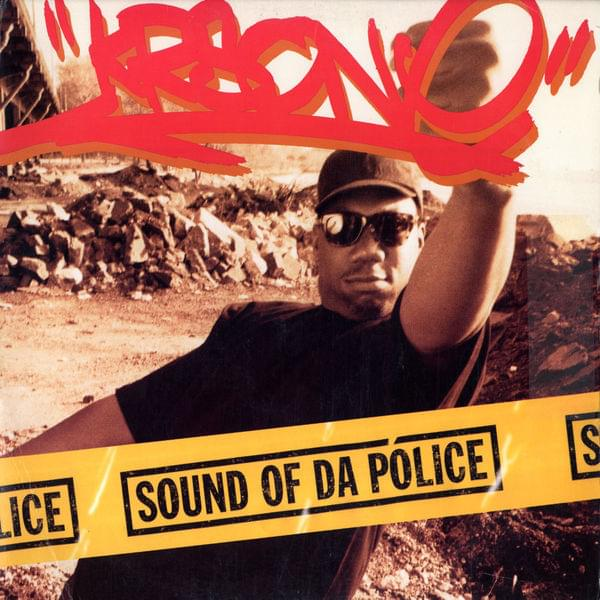

# General Framework

<br>
<br>

.image-90[

]

???

This dissertation is about the different ways neighborhoods control crime.

In it I propose an integrative theory that links collective efficacy to opportunity-based explanations for crime using concepts from routine activities

CE focuses on informal control--guardians--but opportunity theories tell us other things matter.
 
The built environment matters. Policing matters.
  
Opportunity lit tells us potential offenders sensitive to many aspects of opportunity.

Lit on crime control, communities, politics tell us non-offenders are sensitive too, and work to reduce opportunities.

Here I propose opportunity-based mechanisms for social structural theories of crime.

Theoretical chapter takes a deep dive at this idea, while empirical chapters examine two components.

---
class: inverse
# A Situational Theory of Neighborhood Crime

<br>
<br>

.image-90[

]

.footnote[Source: Matsueda. 2016. "Toward an Analytical Sociology: The Micro-Macro Problem, Causal Mechanisms, and Public Policy."]

???

Bit of a struggle; idea for chapter only appeared around prospectus defense; title isn't even set

Ross suggested writing a chapter laying out the theories clearly, then articulating similarities and differences; that's the first half.

In defense, we talked about important of meaning and perception to my framework.

Second half goes deep into this--lot of uncharted territory for me; will be working with Ross on this going forward

---
# Overview

1. Crime requires opportunities

   * People act on perceived not objective opportunities

???

A crime is a particular outcome of an opportunity.

Opportunities have a real objective component--but people act on perceptions not objective. If these things diverge, a theory of perception is important

--

2. Opportunities and crimes are situational

???

Opportunities are a type of situation, a particular configuration of actors acting and reacting to each other

In situations, roles and expectations become important, but things also develop and emerge unexpectedly

--

3. Neighborhood social structure impacts situations (macro -> micro)

   a. What situations occur and where
   
   b. Roles individuals take in situations
   
   c. How situations unfold

???

Crime is an outcome of situations, so macro factors that impact crime must operate through situations--a macro-micro link.

How exactly? Through people's perceptions, norms, and expectations, which determine how they act in situations and also what situations they get into in the first place.

--

4. Situations impact neighborhood social structure (micro -> macro)

   a. Experience, observation, communication produce shared meanings

???

There's also a micro-macro relationship. Macro structures related to crime emerge as a result of things that happen in situations.

This includes things like reputations and norms; or sparks for collective action. This provides some mechanisms for neighborhood change, both social and physical.

Still working on these things.

---
# Contribution

* Empirical relevance

   * Clarify assumptions made in macro-models
      * Where will they likely break down?
      * When do we need to model perception?
      * What are consequences of emergence?

   * Testable hypotheses
      * Where outcomes are more/less predictable
      * Where perceived and objective opportunity diverge

--

* Theoretical relevance

  * Micro-macro mechanisms for neighborhood theories
  * Connects many areas of crime literature
     * Linguistically and conceptually

???

Big contribution for me was expanding my brain a bit--going into new and difficult territory

Would have been much easier to do another empirical chapter, but would have gotten much less out of it

---
class: inverse
# Empirical Chapters

.image-90[

]

* Extension of collective efficacy model

* Two alternate crime control pathways

   * Rely partly or fully on institutional actors

* Data from 1995 PHDCN-CS, 2001-2003 CCAHS, census, Chicago PD

---
class: inverse
# Collective Efficacy and the Built Environment

.image-75[

]

.footnote[Source: Branas et al. 2018. "Citywide cluster randomized trial to restore blighted vacant land and its effects on violence, crime, and fear."]

???

MacDonald, Branas and others have shown with field experiments that removing or remediating features reduces crime

How do communities already use this as a crime control technique?

---
# Overview

Question: *Does collective efficacy affect crime through the built environment?*

--

* Collective efficacy is a problem-solving capacity

???

It isn't just direct informal control; can activate as many forms of action

--

* Opportunity is structured by the built environment

   * Many features are both criminogenic and beneficial
   * Opportunities often crime specific

???

Built environment has impacts via selection: People go places to accomplish goals

Some features have few legitimate situational uses, others have many--but legitimate uses produce opportunities too; opportunities produce tend to be crime specific, like robbery where people carry cash.

--

* Residents recognize that some features of the built environment provide criminal opportunities

   * e.g., Abandoned buildings, vacant lots, bars, liquor stores

--

* Residents may use solving capacity to remove these

  * Effects slow but long lasting
  * Current environment is the result of past efforts

???

If folks recognize a place present an opportunity, they may work to address it. This chapter focuses on removal or keeping things out, but that's not only option--could modify, but I can't measure that.

Built environment changes pretty slowly and changes are semi-permanent, so the current environment is a result in part of past efforts.

---
# The Model

<br>
<br>

```{r, echo=FALSE, fig.align='center'}

```

???

Those ideas give us this model.

---

.image-threequarterwidth[
```{r, echo=FALSE, fig.align='center'}

```
]

.footnote[
.pull-left40[
### The Data:

1641 Chicago blocks nested in 343 neighborhoods
]
]

---
# Method and Results

* Piecewise multilevel structural equations

   * One set focusing on predicting crime
   * One set predicting built environment and present collective efficacy

--

* Crime

  * Abandoned buildings predict violence
  * Commercial props predicts property crime
  * Collective efficacy effects very weak

--

* Built environment

  * Collective efficacy predicts fewer abandoned buildings and commercial properties
  * Built environment doesn't predict collective efficacy

---
# Contribution


* Built environment may be mechanism for collective efficacy

   * Passive effect reduces need for intervention
   * Long-lasting effects
   * Other benefits than just crime control

--

* Control of built environment may impact neighborhood stratification

   * Preventing unwanted developments shifts them elsewhere
   * Can out-compete other neighborhoods for desirable features
   * Interventions may be needed to "even the playing field"


---
class: inverse
# Collective Efficacy and Formal Social Control

.image-shorter[

]

.footnote[Source: KRS-One. 1993. "Sound of da Police." *woop woop*]

---
# Overview

Question: *How does police effectiveness and legitimacy relate to collective efficacy?*

--

* Two theories in literature:

   * Effective policing increases willingness of residents to engage in informal social control (Silver & Miller 2004; Drakulich & Crutchfield 2013)
   * Formal and informal control are parallel and both depend on willingness of residents to engage (Bursik & Grasmick 1993; Sampson 2012)

--

* Also my theory:

  * Police efficacy impacts (perceived) willingness to invoke police
  * Informal control is more effective when residents are (perceived as) willing to escalate to calling the police
     * Changes the nature of the situation


---
# Model

<br>
<br>

.image-90[
```{r, echo=FALSE}

```
]

???

Wanted to take question seriously, test different ways these could be related

---
# Method and Results

* Random effects, fixed effects, Markov random fields, additive splines, instrumental variables, cross-lagged panel models...

   * Results fairly insensitive to specification

???

Threw the damned kitchen sink at it; squeeze blood from stone

--

* Consistent evidence the police efficacy is descended from collective efficacy

   * Some evidence for "faster" effect from IV model
   
--

* Weak evidence for moderation

   * Expected direction but underpowered test
   * Mixed evidence for effects of collective efficacy and police efficacy on crime in general

---
# Implications

* Research treating perceptions of police as preceding collective efficacy may be misleading

   * Post-treatment bias, reverse causality, false mediation 
   * Needs replication, but difficult to test convincingly (i.e., manipulate)

--

* Policy implication: Increasing police efficacy may not be effective for increasing collective efficacy

   * Still important anyway: Effects on crime, improve outcomes of police-citizen encounters

--

* Mediating actors are important

   * Does this look similar for city government and the built environment?

---
class: inverse

# Thank you!

---
# Q & A

*Questions for me?*

<br>

*Questions for you!*

Empirical Chapters:

* What is left to do?
* Threats to research design / conclusions?
* Where should they go?
* New questions that emerge?

Theory Chapter:

* What else should I (we) address?
* Wider applications or implications?

