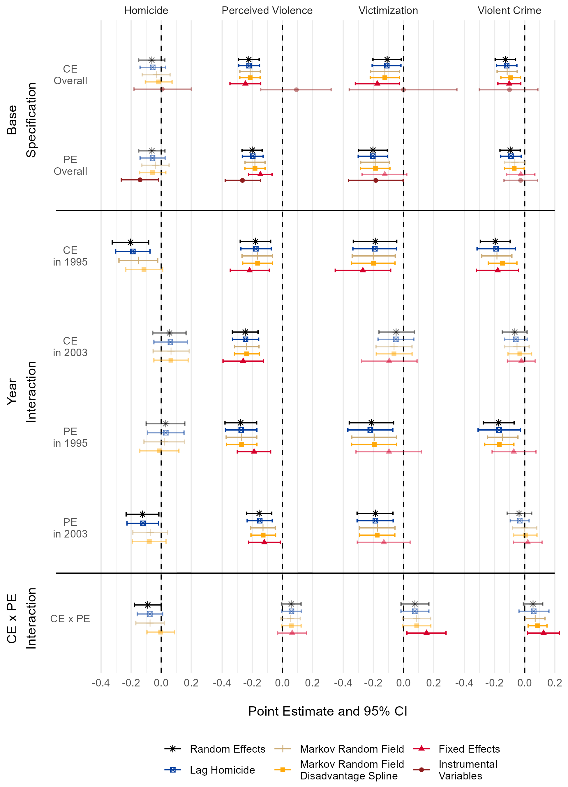

# Collective Efficacy and Formal Social Control {#formalcontrol}

## Introduction

The goal of this chapter is to interrogate the role of resident perceptions of police effectiveness and legitimacy in the neighborhood social control system of collective efficacy theory. Collective efficacy is a neighborhood’s capacity for achieving an intended effect, such as regulating child behavior or maintaining public order [@sampsonNeighborhoodsViolentCrime1997a]. Some authors describe collective efficacy as in part the result of perceptions of legitimate, effective, and responsive policing—police efficacy. When police efficacy is high, it promotes collective efficacy resulting in residents being more likely to engage in acts of informal social control [@drakulichRolePerceptionsPolice2013; @silverSourcesInformalSocial2004]. Sampson [-@sampsonGreatAmericanCity2012; @sampsonNeighborhoodsViolentCrime1997a], however, describes collective efficacy as the ultimate source for all forms of neighborhood social control, including both informal control actions by residents and calls to police for formal control actions. This suggests efficacious policing is promoted by collective efficacy rather than vice versa.

In attempting to adjudicate between these two theories, I ask the question: Does efficacious policing foster collective efficacy, or does efficacious policing depend on the collective efficacy of the community? Additionally, I examine the possibility that collective efficacy and police efficacy reinforce one-another, yielding multiplicative effects on crime. In approaching these questions, I consider how social contexts like collective efficacy and police efficacy may influence how individuals respond to the unwanted behavior of others.

### Collective Efficacy and Police Efficacy

Research on collective efficacy asserts informal social control is a primary mechanism by which neighborhoods regulate crime and deviance [@sampsonGreatAmericanCity2012, p. 152]. Collective efficacy is frequently used to operationalize the capacity for informal social control [@lanfearBrokenWindowsInformal2020], which manifests mainly as actions by neighborhood residents like monitoring and direct intervention against deviance and public disturbances [@sampsonNeighborhoodsViolentCrime1997a]. It is claimed that collective efficacy also affects crime by increasing the propensity of residents to call the police [@sampsonSystematicSocialObservation1999; @sampsonGreatAmericanCity2012, p. 152]. In the context of collective efficacy, Sampson and Raudenbush [-@sampsonSystematicSocialObservation1999, p. 612] state, “actions of informal control need not … exclude the police or other formal channels of recourse.” What marks this as informal control, from their description, is that it is resident-initiated. The overwhelming majority of police contacts are, however, initiated by calls for service [@blackSocialOrganizationArrest1971; @gottfredsonDecisionMakingCriminal1988]. If the invocation of police by neighborhood residents is included under the umbrella of informal control, it narrows what may be considered formal social control to proactive policing. It also broadens informal social control to include the majority of police interactions with the public. 

I argue a distinction should be made between actions of formal and informal social control, because they are alternate methods for solving problematic situations. Informal control actions are the result of individuals without a formal role assuming responsibility for the regulation of others’ behavior in a given situation. In contrast, when someone calls the police, they are invoking an agent of the state with a formal role that charges them with legal authority to resolve a situation and the corresponding capacity to use violence for this purpose [@wilsonBrokenWindows1982]. By invoking the police, the individual who initiates the call defers responsibility for handling the situation to others. This distinction is important because the decision to defer responsibility is likely based in part on the individual’s belief the police will be responsive, effective, and fair in their treatment [@tylerLegitimacyCooperationWhy2008]. Past research indicates these beliefs about effectiveness and legitimacy of police are largely grounded in respondents direct and vicarious experiences from interactions with police [@tylerTrustLawEncouraging2002a; @tylerWhyPeopleObey2006]. The context of decisions to invoke police may be framed as a principal-agent problem in which the potential caller is the principal and the police are the agents [@dharmapalaPunitivePoliceAgency2016]. The decision to call upon the police is determined by considerations like the perceived effectiveness of these agents in resolving the situation and the potential for unintended harm that their involvement carries. While both formal and informal control may be initiated by residents—and may even be seen as substitutes by those residents—they are not equivalent in their availability, effectiveness, or consequences.

The distinction between capacities for formal and informal control has already been made in the literature examining collective efficacy and police efficacy [e.g., @drakulichRolePerceptionsPolice2013; @silverSourcesInformalSocial2004]. In this literature, collective efficacy is usually assumed to capture informal control capacity and is treated as the primary proximal determinant of neighborhood variation in crime and deviance. Formal social control capacity is assumed to precede collective efficacy. For example, Silver and Miller’s [-@silverSourcesInformalSocial2004] cross-sectional analysis found satisfaction with police was a strong predictor of neighborhood collective efficacy in Chicago, suggesting effective policing increases informal social control capacity. Causal order in that work was made by assumption, based on the belief that “residents are [unlikely] to base their perceptions of local police on their neighbors’ social control behaviors” [@silverSourcesInformalSocial2004, p. 574]. This is a plausible assumption, but it is also an empirical question whether perceptions of police are causally descended from collective efficacy. They also did not attempt to evaluate the effects of collective efficacy and police efficacy on crime, a task taken up in this analysis. 

@drakulichRolePerceptionsPolice2013 reported similar results using data from Seattle, and found police efficacy explained the association between neighborhood racial composition and collective efficacy. Police efficacy, they assert, fosters collective efficacy by reducing the perceived costs of engaging in informal social control. Experiences with and perceptions of procedural injustice produce lower police efficacy in neighborhoods with larger minority populations. This translates into reduced informal control capacity. As with @silverSourcesInformalSocial2004, @drakulichRolePerceptionsPolice2013 do not examine the effects of police efficacy and collective efficacy on crime, nor do they consider the opposite causal ordering: collective efficacy precedes police efficacy.

In contrast to the literature placing police efficacy as a precursor to informal social control, the systemic model of social disorganization casts formal social control as concurrent to informal social control [@bursikNeighborhoodsCrimeDimensions1993]. The systemic model describes the neighborhood system of social control as consisting of interlocking levels which are loosely connected or “articulated”: private, parochial, and public social control. They are separate, drawing on different sources, operating through different actions, and sometimes responding to different problems. All levels must be present and working in coordination with the others for the system to function properly and maintain low rates of crime. In the systemic model, the direct intervention and monitoring actions most often associated with collective efficacy are part of parochial control. When residents call the police, however, they invoke agents who exert actions of public social control.

Sampson and Raudenbush [-@sampsonSystematicSocialObservation1999, p. 612] link collective efficacy to this multi-pathway systemic model, but emphasize the agency of neighborhood residents as the key causal force. From this perspective, there are separate private, parochial, and public levels of social control, but all are initiated by individual and collective action of residents. Collective efficacy captures not just the capacity for direct informal control but the general capacity of a neighborhood to activate any pathways of social control. This suggests collective efficacy is an antecedent to the use of formal social control. The impetus for social control may come from residents, but the police may be used to address situations which residents may perceive as too risky for direct intervention or otherwise not their responsibility. Despite describing this causal sequence, the authors have not, to my knowledge, explored this empirically. This connection seems straightforward, however, as most policing occurs in reaction to a citizen calls for service, so citizen intervention is a necessary starting point [@blackSocialOrganizationArrest1971; @gottfredsonDecisionMakingCriminal1988]. If collective efficacy predicts monitoring and reporting behavior by residents, it will result in more frequent and rapid police responses. Thus, collective efficacy may precede subjective perceptions of effective policing because it increases the objective effectiveness of policing with regard to reducing crime and other incidents perceived as problematic to residents.

Carr’s [-@carrCitizensCommunityCrime2012; -@carrCleanStreetsControlling2005; -@carrNewParochialismImplications2003] “new parochialism” reflects a similar causal ordering. In his study of a middle-class white Chicago neighborhood, he found residents engaged in informal social control activities—parochial control—that were facilitated by external organizations and formal authorities—public social control agents. When residents initiated action, they used formal authorities as a buffer between themselves and problems in their communities, in part due to the perceived costs of intervention. The residents of Carr’s [-@carrCleanStreetsControlling2005] study reported that this shift toward hybrid parochial and public social control was a recent change due to broad shifts in the context of control, such as heightened fear of gangs and drug crime, reduced informal monitoring capacity due to dual-income households with long work hours, and declining acceptability of sanctioning others’ children for misbehavior. These changes led residents to rely on structured and safe methods of engagement. These findings are important for the present work because Carr’s study was conducted in Chicago in 1993 through 1999—the same city and period in which the data used in this work were collected.

### Collective Efficacy, Police Efficacy, and Mechanisms of Social Control

@sampsonGreatAmericanCity2012 proposes that collective efficacy captures the general capacity for social control in neighborhoods. Formal and informal control represent different forms of activation of this capacity. Figure \@ref(fig:controldiagram) is a simplified illustration of this model. The question, then, is what predicts the use of different forms of activation, and how are they related to crime control? If our interest is only in the overall effect of collective efficacy, this question may be inconsequential: all methods of control are only mechanisms for collective efficacy. If, however, we wish to decompose this total effect or we expect other factors to influence the effects of different pathways, we must consider the differences between acts of informal and formal social control and the roles of actors that perform each.\linebreak
 \linebreak


```{r controldiagram, echo=FALSE, fig.align='center', out.width="60%", fig.cap="Collective efficacy as capacity for informal and formal control actions."}
knitr::include_graphics("./figure/ch3/ce_pe_framework.pdf")
```


Collective efficacy is typically measured using a scale of survey responses by residents describing both their expectations that their neighbors would intervene against deviance and their belief that norms and values are shared among those neighbors [@sampsonNeighborhoodsViolentCrime1997a]. Despite capturing expectations for intervention, the form those interventions might take is not specified. These indicators thus tap shared beliefs about the actors that initiate any social control actions in a neighborhood, actors who, importantly, are also those performing the actions of informal social control.^[The residents are essentially describing a generalized other of the group to which they belong.]  While collective efficacy does describe the actors that typically initiate formal social control, it does not tap residents’ beliefs about the actors that, once invoked, carry out those actions of formal social control—the police. Instead, police efficacy describes expectations for the behavior of these formal social control actors: beliefs about whether police will respond, and if they do, if they will be effective and fair.

If most social control actions are initiated by residents, collective efficacy may capture the propensity to activate any mechanism of social control, but police efficacy may more narrowly capture resident willingness to activate the formal social control mechanism by calling the police [e.g., @kirkLegalCynicismCollective2011]. Given the same number of situations provoking interventions, it is possible that the willingness to invoke the police may only alter the balance of actions of formal versus informal control, rather than the overall number of actions or their effectiveness. Alternatively, it is also possible that the context of police efficacy changes the calculus of intervention itself, resulting in interventions of different quality and quantity.

### Collective Efficacy in the Shadow of the Law

I argue that the neighborhood context of social control determines what individuals view as relevant means for resolving problematic situations resulting from the unwanted behavior of others. While rooted in individual perceptions, neither collective efficacy nor police efficacy are properties of individuals. Rather, they are properties of neighborhoods which reflect the shared meanings of the people who live there, and presumably to some degree also the people who visit those places, hear about them, and communicate with their residents. These shared meanings provide the social context in which actors decide how to approach problematic situations and behave within those situations.

A context of high collective efficacy is one in which people generally believe in shared norms of behavior and intervention against violations of those norms is warranted and likely to occur. A context of high police efficacy is one in which people perceive that police will intervene effectively and fairly when invoked by residents. Note that the mechanism(s) that connect collective efficacy and police efficacy to incidents of crime are ambiguous: For example, it may be deterrence or reduction in opportunity [e.g., @sampsonGreatAmericanCity2012], acceptance of legitimacy of shared norms or the law [e.g., @tylerWhyPeopleObey2006], or both. While these mechanisms are important for theory and policy the present analysis neither tests nor assumes any specific mechanism for observed effects on crime. Regardless of which mechanism is operating, because police require the public to invoke them in the first place, it is unlikely they will be perceived as responsive or effective in a context of low collective efficacy where the public infrequently intervenes in problematic situations. In such a context the police can only operate proactively, and proactive policing is less likely to be perceived as effective or legitimate by residents [@faganStreetStopsBroken2001; @tylerConsequencesBeingObject2015]. This may provide a direct mechanism linking low collective efficacy to low police efficacy.

Consider also the possibility that perceptions of formal social control capacity change the context, and thus the meaning, of acts of informal social control: Informal social control may exist in the shadow of the law [@mnookinBargainingShadowLaw1979]. When informal sanctions are insufficient to stop problem behavior, invocation of formal authority provides a last resort. An offender may be deterred from committing an offense not because the informal sanction itself carries weight, but because they believe the sanctioner will call the police if ignored. Likewise, sanctioners may perceive of a situation as less risky for intervention, because effective policing makes retaliation unlikely [@st.jeanPocketsCrimeBroken2007]. Informal control lacks these buttresses where potential sanctioners are unwilling to call the police because they believe they will be ineffective or harmful, and where targets of sanctions are aware of this reluctance. Thus, absent the threat of formal control, residents may be unwilling to intervene against deviance and offenders may have little fear of sanctions. This implies moderation in which police efficacy enhances the effect of collective efficacy on crime. This may be particularly consequential in neighborhoods with large BIPOC populations that report low police efficacy [@drakulichRolePerceptionsPolice2013; @tylerLegitimacyCooperationWhy2008]. This may result in higher perceived costs to invoking police, resulting in fewer calls or calls only for serious crimes. 

### Moderation or Causal Sequence

The extant literature presents two hypothetical relationships that could occur between collective efficacy and police efficacy, which I will refer to as causal sequence hypotheses. The causal sequence hypotheses are based on the idea that informal and formal social control are not parallel problem-solving pathways, but rather links in a chain. These sequential relationships may manifest in either direction (or both at once). If effective policing emerges as a result of the general propensity of residents to intervene against crime and deviance, then police efficacy may be causally descended from collective efficacy [e.g. @sampsonGreatAmericanCity2012]. If willingness to engage in informal control depends on residents perceiving that they are supported by effective policing, collective efficacy may be causally descended from police efficacy [e.g. @drakulichRolePerceptionsPolice2013; @silverSourcesInformalSocial2004].

I also introduce an alternative hypothesis: moderation. The moderation hypothesis posits that informal and formal social control are separate problem-solving pathways, but the capacities for each alter the context of intervention. Residents may use either to deal with local problems, likely preferring the one perceived as more effective or appropriate in a given situation. But, the availability of alternatives—in particular escalation to formal control—changes the decision-making process for all actors involved. There are two forms this moderation may take: Reinforcing moderation, the form I anticipate, may exist if perceptions of effective policing cause offenders to treat informal sanctions and monitoring more seriously and residents to perceive lower risks to their interventions. If true, when collective efficacy and police efficacy are both high, crime and victimization will be lower than expected from an additive relationship.

There is an alternate moderation hypothesis, however. It may be the case that so long as either capacity for control is high, crime and victimization will be low. That is, social control capacities may reach a plateau where additional capacity is only surplus. This would produce a convergence in levels of crime between areas with high collective efficacy, high police efficacy, and both. This is analogous to St. Jean’s [-@st.jeanPocketsCrimeBroken2007] finding that crime is minimal on blocks where either collective efficacy is high or social disorder is low. Pockets of crime in his study area were the result of a multiplicative convergence of disadvantage.

Temporal scale is a final consideration that has not been examined by the existing research in this area [see @taylorCommunityCriminologyFundamentals2015]. Prominent studies on collective efficacy and police efficacy use cross-sectional research designs [e.g. @drakulichRolePerceptionsPolice2013; @silverSourcesInformalSocial2004], which prevent examining the speed at which mechanisms might transmit causal effects between these factors. For example, collective efficacy may increase police efficacy by promoting more (and better informed) calls to police which in turn produces more effective responses. It may, however, take many incidents over a long period of time in which police are effective and procedurally just to improve the shared understanding of police efficacy in the neighborhood. Conversely, the effect of police efficacy on collective efficacy might be immediate if residents are emboldened to intervene by the belief that police responses will be effective. The literature in this area does not present strong prior expectations for the speed of causal effects. Consequently, I make no hypotheses regarding temporal scaling and model both lagged and immediate causal relationships.

 Importantly, more than one of these hypothetical relationships may be present at once. There may, for instance, be moderated mediation between collective efficacy and police efficacy with regard to crime. For example, collective efficacy may lead to police efficacy but police efficacy may increase the effectiveness of informal social control in reducing crime. Adjudicating between different causal relations is difficult, and different assumptions may lead researchers to find support for each provided the same data. Figure \@ref(fig:fclongitudinalmodel) depicts a model with two time periods (past and present) where all hypothesized relationships between collective efficacy and police efficacy are present. Crime and simultaneous effects are omitted in the past period for simplicity. Cross-lagged effects represent gradual causal processes, while simultaneous effects represent relatively fast causal processes. Moderation is displayed here as arrows impacting the direct causal effects of collective efficacy and police efficacy on crime.\linebreak
 \linebreak


```{r fclongitudinalmodel, echo=FALSE, fig.align='center', out.width="90%", fig.cap="Potential effects of collective efficacy and police efficacy."}
knitr::include_graphics("./figure/ch3/longitudinal_model.pdf")
```


I restate my hypotheses here, in the order they will be tested:

1.	Police efficacy and collective efficacy moderate each others' effects on crime.
2.	Police efficacy and collective efficacy are causally ordered. There are two components of this hypothesis:
    a. Police efficacy is an antecedent of collective efficacy. This may occur either slowly (lagged effects) or rapidly (simultaneous effect).
    b. Collective efficacy is an antecedent of police efficacy. This may occur either slowly (lagged effect) or rapidly (simultaneous effect).
   
In the following sections, I briefly describe the data used to test these hypotheses, paying particular attention to measurement, then walk through the estimation approaches at length, discussing how they address potential violations of modeling assumptions.

## Data and Measurement

This chapter uses a two-period neighborhood-level panel data set assembled from the 1995 Project on Human Development in Chicago Neighborhoods Community Survey (PHDCN-CS) [@earlsProjectHumanDevelopment1999] and the 2003 Chicago Community Adult Health Study (CCAHS) [@houseChicagoCommunityAdult2011]. These survey data are augmented with neighborhood measures constructed from indicators in the Longitudinal Tract Data Base (LTDB) [@loganInterpolatingDecennialCensus2014] and police-reported crime from publicly accessible Chicago Police Department records [@Crimes2001Present2020]. Because the data used here are identical to those used for Chapter \@ref(builtenvironment), they are fully described in Appendix \@ref(measures) to minimize redundancy. That appendix describes the data sources and details the measurement strategies which apply to both chapters. Table \@ref(tab:fcdescrip) depicts descriptive statistics for the measures used in this chapter. The following section details methods specific to this chapter.


```{r, echo=FALSE, message=FALSE, warning=FALSE, eval=TRUE, ft.arraystretch = 1}
source("./syntax/ch3_descriptives_table.R")
ch3_descriptives  %>%
  set_caption(caption = "(\\#tab:fcdescrip) Descriptive statistics.")
```


I conceptualize police efficacy as a neighborhood-level capacity to call upon police to engage in social control in accordance with the expectations of residents. That is, a neighborhood with high police efficacy is one where residents believe the police are capable of combatting crime, will respond and investigate when called, and will treat both callers and suspects fairly and respectfully. This definition encompasses both effectiveness and legitimacy, which are commonly found to be distinct in research on policing procedures [@tylerWhyPeopleObey2006], though @sampsonLegalCynicismSubcultural1998 combined five measures capturing both effectiveness and legitimacy (as “police satisfaction”) in their analysis of legal cynicism using the PHDCN-CS. The same scale was also used by @silverSourcesInformalSocial2004. One prominent study combined indicators of police efficacy into a legal cynicism construct [@kirkLegalCynicismCollective2011]. As documented in Appendix \@ref(legalcynicism), I found evidence in support of separating police efficacy from legal cynicism and omitting legal cynicism from the overall analysis.

To construct a police efficacy scale, I begin with the five indicators used by @sampsonLegalCynicismSubcultural1998 and @silverSourcesInformalSocial2004 which encompass responsiveness, effectiveness in maintaining order and controlling crime, and fair treatment of both victims and suspects (see Appendix \@ref(measures)). To these prior measures, I add three indicators reflecting resident perceptions of change in police protection over the last 5 years, excessive use of force, and failure to patrol and respond to calls. All eight measures are used together as factor analysis suggests the indicators are not clearly separable into different effectiveness and legitimacy factors, though they are separable from the indicators of collective efficacy—informal social control expectations and cohesion and trust. The 2003 police efficacy measure constructed from the CCAHS includes only three measures which encompass effectiveness, responsiveness, and fairness. The police efficacy measures are moderately correlated across waves ($\rho = 0.37$), somewhat less so than collective efficacy ($\rho = 0.47$). In figures below, the police efficacy measures are labeled $PE_{A}$ for 1995 and $PE_{B}$ for 2003 to remind the reader they are constructed from different indicators.

The crime measures used are police-reported homicide, survey-reported perceived violence, survey-reported violent victimization, and violent crime. The violent crime measure is a composite of two different measures. In 2003 the measure is constructed from the sum of homicides, robberies, and aggravated assaults and batteries in 2003 divided by the year 2000 population. In 1995, I use the violent crime measure from the PHDCN-CS aggregate NC-level dataset from ICPSR [@earlsProjectHumanDevelopment1999]. ^[This measure is undocumented, so it is uncertain if it represents police-reported violent crime like the constructed 2003 measure or some other composite measure such as the one used by @sampsonLegalCynicismSubcultural1998. The 1995 violent crime measure is correlated approximately 0.89 with the sum of the standardized homicide, perceived violence, and victimization measures, which is the index construction method described by @sampsonLegalCynicismSubcultural1998. Performing the same operation on the 2003 data yields a correlation of 0.53 with the police-report based violent crime measure. I thus strongly suspect this is indeed the index from @sampsonLegalCynicismSubcultural1998.] The interwave correlation for the two violent crime measures is 0.61 which is higher than that for any of the other crime measures. It is, however, more strongly correlated with the other 1995 crime measures than the 2003 violent crime measure is with the other 2003 measures. Thus the 1995 violent crime measure should be viewed cautiously. Unfortunately, I have no alternative measure for 1995 violent crime as the PHDCN does not provide one and the Chicago Police Department only provides data from the year 2000 onward. The ICPSR release of the PHDCN-CS is also missing values for homicide and violent crime in 1995 for one neighborhood. This observation is dropped in random- and fixed-effects models but included via full-information maximum likelihood in structural equation models. Inclusion has no impact on estimates.

## Methods and Results

I use three general estimation strategies to test my hypotheses. I use random- and fixed-effects panel models test Hypothesis 1: collective efficacy and police efficacy moderate each other’s effects on crime. Before testing this moderation hypothesis, I use two specifications to evaluate conditional associations of collective efficacy and police efficacy with crime, both overall and within each panel year. Moderation is unlikely to be found if those conditional associations are weak or absent—as appears to be the case in 2003.

Hypothesis 2, that police efficacy and collective efficacy are causally ordered, is tested using two forms of structural equations: cross-lagged panel models and a simultaneous effect instrumental variables model. These models allow evaluating the directionality of associations using temporal ordering and assumptions about conditional independence. Using both types of model helps address the possibility that causal effects operate at different rates: cross-lagged models assume an 8-year lagged effect while the instrumental variables model assume they operate over the short term. Both forms of structural equation relax the assumption of time-invariant parameters by permitting the effects of collective efficacy and police efficacy on crime to differ in 1995 and 2003.

### Random- and Fixed-Effects Panel Models

The first estimation strategy uses random- and fixed-effects panel models to estimate the conditional direct effects of collective efficacy and police efficacy on crime and test for moderation of these effects. These models correspond to the arrows in Figure \@ref(fig:fclongitudinalmodel) from collective efficacy and police efficacy to crime and the labeled moderation pathways. For these models, I first describe the estimation approaches and model specifications before discussing results.

For all four outcomes—homicide, victimization, violent crime, and perceived violence—I use four estimation approaches, and, within each approach, either three or four different specifications. These models make the assumption collective efficacy and policy efficacy have independent simultaneous effects on crime and neither is a mediator for the others’ effects. If, for instance, police efficacy influences crime and is in part the result of collective efficacy, including it in a model alongside collective efficacy will attenuate the estimated effect of collective efficacy on crime. This is conditioning on a post-treatment mediator—controlling, in effect, for a mechanism of the causal variable of interest. If this attenuation occurs, however, it suggests police efficacy is either a mediator for collective efficacy or, if not, the effect of collective efficacy on crime is partly spurious, and police efficacy is an omitted variable in past studies.

#### Random effects

The first estimation approach is a simple panel regression with random intercepts for neighborhoods. For homicide, this is a Poisson regression with a population exposure term for which the coefficient is fixed to 1.^[Respecifying this as a negative binomial model reveals no evidence of overdispersion.]  For the other outcomes, this is a standard linear regression. Identification of treatment effects in this approach relies on strong ignorability given covariates—adjustment for anything causally antecedent to both crime and either collective efficacy or police efficacy [see @lanfearBrokenWindowsInformal2020]. This includes both time varying and time stable confounders. An implication of this assumption is that we must assume there is no effect of past crime on present crime except through included covariates. If there is a direct effect of past crime on present crime or one mediated by any omitted variable, it will bias estimates for collective efficacy and police efficacy, because past research strongly suggests they are influenced by crime [@sampsonGreatAmericanCity2012; @sampsonLegalCynicismSubcultural1998].

#### Lag homicide

The second estimation approach partially relaxes the assumption that past crime does not predict present crime—either directly or via an omitted mediator—by using the lag homicide rate as a predictor. Due to the absence of 1990 measures for any other outcomes, homicide must be used for lagged crime across all specifications. Note that while this is a conventional dynamic panel estimator for the homicide outcome [@wooldridgeEconometricAnalysisCross2010], it is not for the other outcomes.^[One might think of it as a dynamic panel model with unmodeled measurement error in the predictor.] Rather, I am making the assumption that homicide captures most or all effects of past crime regardless of the outcome under consideration. Auxiliary models predicting second wave crime outcomes suggest this is the case except for perceived violence, where 1995 perceived violence dominates homicide in predicting 2003 perceived violence. However, perceived violence in 1995 has no substantively or statistically significant relationship with 2003 collective efficacy or police efficacy, so it is possible it may not threaten identification. These models retain the random effects from the prior specification, except in the case of violent crime where a standard linear model with heteroskedasticity and autocorrelation consistent standard errors is used due to is insufficient inter-neighborhood residual variation to stably estimate random effects. 

#### Fixed effects

We can relax the assumption that there are no time-stable omitted confounders using unit fixed effects specifications. With a two-wave fixed effects specification, we are estimating the relationship between deviations from unit-level means of the regressors and outcomes. This specification produces two major limitations: efficiency and inability to model stability over time. Fixed effects specifications use an additional degree of freedom for every observation, resulting in larger standard errors. They also cannot model observations for which there was no change between time periods. This does not result in bias, but does diminish statistical power. This second limitation is particularly problematic for rare outcomes like homicide. In the present case, 111 of the 342 neighborhoods with homicide data experienced the same number of homicides in both waves, including 75 which experienced none in either wave.^[If homicide is specified as a rate, rather than count, it is possible to recover the non-zero values due to changing population size (denominator). I chose not to do this as I would still lose over a quarter of all neighborhoods.] Due to the large number of observations that would be dropped due to fixed effects, tests would be quite underpowered. Consequently, I do not model homicide using this specification. The other outcomes are modeled using the fixed-effects ordinary least squares regressions from the `fixest` R package [@bergeEfficientEstimationMaximum2018] with heteroskedasticity and autocorrelation consistent standard errors from the `sandwich` package [@zeileisVariousVersatileVariances2020].

Unit fixed effects models make the assumptions that past treatments (1) do not influence current outcomes (except via included covariates) and (2) past outcomes do not influence treatment [@imaiWhenShouldWe2019]. Chapter \@ref(builtenvironment) of this dissertation suggests the first assumption is violated in the case of collective efficacy, as past collective efficacy may exert crime-controlling effects via the built environment. This is typically addressed using lagged treatment variables [@imaiWhenShouldWe2019], but these are not available in the present data. Chapter \@ref(builtenvironment) indicates these effects are modest in magnitude, however, and thus unlikely to induce notable bias (though this does not rule out other mechanisms). Canonical research on collective efficacy suggests the second assumption is also violated due to feedback effects of crime on collective efficacy [e.g., @sampsonGreatAmericanCity2012]. While this may result in some bias in estimates, research adjusting for feedback effects of crime finds similar results to models without this adjustment [e.g., @sampsonGreatAmericanCity2012; @sampsonSystematicSocialObservation1999]. Later in this section I describe an approach based on @sampsonSystematicSocialObservation1999 which attempts to adjust for potential feedback effects of crime on collective efficacy using instrumental variables.

#### Gaussian Markov random field

It is reasonable to expect that crime rates in one neighborhood may depend on what occurs in other nearby neighborhoods. Spatial dependence in general will bias estimates of standard errors, and some forms—interference—will also threaten identification of treatment effects such as for collective efficacy. Moran’s I tests of residual spatial dependence indicate most of the random effects specifications exhibit spatial dependence (but generally not the fixed effects). To address spatial dependence, my next estimation approach uses generalized additive models (GAMs) with a Gaussian Markov random field (MRF) spatial smoother fit using R’s `mgcv` package [@woodGeneralizedAdditiveModels2017]. This approach models spatial dependence between observations using a spatial random effect assumed drawn from a normal distribution with a mean equal to the mean of neighboring unit random effects. In MRFs, the “Markov” signifies that observations are independent of all non-neighboring observations conditional on their neighbors—like a Markov chain, it is “memory-less” as any given state only depends on its immediate antecedents. This independence assumption is relatively weak in many applications and makes large sample estimation tractable. Consequently, GRMFs are one of the most common approaches to spatial statistical modeling [@rueGaussianMarkovRandom2005].

#### Instrumental variables

The last approach uses reciprocated exchange and kinship and friendship ties as instruments for collective efficacy analogous to the approach of @sampsonSystematicSocialObservation1999. Those authors used reciprocated exchange, kinship and friendship ties, and neighborhood attachment as instruments for the effect of collective efficacy on crime in cross-sectional simultaneous equations using the same 1995 data as the present study. There, they found reciprocal effects between collective efficacy and both homicide and robbery. The attachment to neighborhood measures are unavailable in the 2003 wave, so here I use only reciprocated exchange and ties. This specification makes the strong and untestable assumption that the only relationship that reciprocated exchange and friend and kinships ties have with crime are explained by collective efficacy or other included covariates [@morganCounterfactualsCausalInference2015]. Fixed effects are retained in this approach except for homicide. Homicide is also transformed into the log of the homicide rate to facilitate using a conventional linear two-stage least squares estimator.

#### Random- and Fixed-Effects Specifications

All approaches above were fit with multiple model specifications both to test hypotheses and relax potentially violated assumptions.  These specifications are a (1) base specification, (2) a year interaction, (3) a interaction of Collective Efficacy with Police Efficacy, and (4) and specifications 1 through 3 with a spline on disadvantage to adjust for residual nonlinearity.

The base specification predicts the given crime outcome with collective efficacy, police efficacy, and five controls—the three structural measures, population density, and a dummy distinguishing panel waves. This specification is suitable for establishing baseline conditional associations between collective efficacy and police efficacy and crime. Note that the fixed effects specifications retain the year dummy control variable to adjust for overall differences in outcomes across waves. As a result, these are two-way fixed effects (TWFE) specifications. Recent research on TWFE estimators suggest they are problematic for causal inference in data with multiple periods and binary treatments due to these estimators calculating treatment effects in relation to already-treated units and assigning negative weights to some cases (Imai & Kim 2020). While research is still developing in settings with continuous treatments, this literature suggests these are less of a concern in two-period settings. Further, the present models are completely insensitive to the presence of the year dummy variable.

A limitation of the base specification is that, by fixing parameters to be invariant across waves, it makes the assumption the effects collective efficacy and police efficacy (as well the controls) are identical across waves of the panel. This assumption may be violated for both artificial and natural reasons. First, the much smaller sample size for the CCAHS means the 2003 measures are less precise than the 1995 measures which may artificially attenuate estimates for the second wave. If this is the case, it is arguable whether relaxing parameter invariance is desirable. Forcing invariance might be seen as borrowing information across waves since the first wave is more precisely estimated. Additionally, for police efficacy, the indicators are different between waves and there are only three indicators in 2003 compared to eight in 1995. If this reduced set of indicators does not tap the same dimensions of the underlying construct, we would expect the factor to exhibit a different relationship with crime. Similarly, if fewer indicators translate into less precision, it may further attenuate estimates. 

Second, we might expect an actual “natural” difference in parameters due to shift in the relative contribution of informal and formal social control actions to rates of crime. This may occur from an increased reliance on invoking police to solve problems across the time period under consideration [@harcourtIllusionOrderFalse2001; @sharkeyUneasyPeaceGreat2018], or shifts away from conventional informal social control into new formally-mediated means (Carr 2003; Carr 2012). The first alternate specification addresses the possibility of varying effects across waves with interaction terms between survey year and both collective efficacy and police efficacy (but not between collective efficacy and police efficacy).

The third specification includes an interaction term between collective efficacy and police efficacy to permit testing Hypothesis 1: Police efficacy and collective efficacy moderate one-another in their effects on crime. If residents are emboldened to engage in informal social control due to the belief they are supported by effective police, we would expect to see a negative interaction coefficient: At high levels of both collective efficacy and police efficacy, there is an additional crime control benefit. In contrast to my theoretical expectation, if the crime control benefits of higher collective efficacy or police efficacy come mainly when the other is low, we may instead see a positive interaction term: At high levels of both collective efficacy and police efficacy, crime is higher than an additive relationship would predict.

The fourth and final specification is used only in a subset of MRF GAM models. Analysis of model residuals from across all estimators and specifications reveals a nonlinear relationship between disadvantage and crime. These GAM models use a nonlinear transformation of disadvantage via a thin-plate regression spline to address the nonlinear correlation in the residuals [@woodGeneralizedAdditiveModels2017]. Thin-plate splines map a predictor on to the outcome via a smooth function with curvature penalized to prevent overfitting. The spline improves model fit notably but appears inconsequential for estimates of collective efficacy and police efficacy and the particular spline shape here is not replicable with any conventional polynomial term of reasonable degree.^[Significant fit improvement was indicated by greater than 6 point reductions in Bayesian Information Criteria values [@rafteryBayesianModelSelection1995] and insignificant combined adjusted quantile tests [@gelmanDataAnalysisUsing2007].] Consequently, the spline model results are presented for comparison, but no similar transformation was attempted in the other approaches. No other covariates appear to display a significant nonlinear association with any of the outcomes.

### Random- and Fixed-Effects Results

Rather than walking through the results for every one of the many estimation approaches and specifications, I graphically display all point estimates of interest and provide a holistic interpretation. Estimates for controls are not presented as they are not substantively meaningful given that collective efficacy and police efficacy are likely mediators of their effects on crime. Figure \@ref(fig:fccoefplot) is a full-page illustration of the point estimates for every combination of estimation approach and model specification described above. The top section shows point estimates of the effects of collective efficacy and police efficacy for the base models. The center section shows point estimates for the year interaction models broken out into year-specific estimates. The bottom section shows results from the collective efficacy and police efficacy interaction models where the displayed point estimates are the interaction terms between collective efficacy and police efficacy.

The tight groupings of point estimates indicate they are fairly insensitive to model specification, except when instrumenting collective efficacy using reciprocated exchange and kinship and friendship ties. Similarly, the consistent error bars indicate precision is not greatly affected by modeling decisions except in the case of the instrumental variables, and, to a lesser degree, fixed effects. The unstable and imprecise estimates for collective efficacy in the instrumental variable specification may be indicative of weak instruments [@bielbyStatisticalPowerNonrecursive1991].\linebreak
 \linebreak


```{r fccoefplot, echo=FALSE, fig.align='center', out.width="80%", fig.scap = "Estimated effects of collective efficacy and police efficacy on four forms of crime from six estimation strategies and four model specifications.", fig.cap="Estimated effects of collective efficacy and police efficacy on four forms of crime from six estimation strategies and four model specifications. Dots are point estimates. Bars are 95\\% confidence intervals. Estimates faded out where intervals include zero."}

```


For collective efficacy, the results indicate an overall modest negative effect on crime, though small and insignificant in the case of homicide. Importantly, this overall effect of collective efficacy appears to be the average of a stronger negative effect in 1995 and, except in the case of perceived violence, a null effect in 2003. This might result if collective efficacy is endogenous to resident perceptions of crime—survey respondents may be basing informal control expectations on perceived crime [@matsuedaMeasuringCollectiveEfficacy2016]. The instrumental variables approach which attempts to adjust for this possibility finds null effects and imprecise estimates for collective efficacy. This appears to be due to two factors: (1) collective efficacy effects are present mainly in 1995, and (2) the inclusion of police efficacy attenuates the conditional association of collective efficacy with crime and greatly reduces precision of the estimates in these models. Restricting the model to 1995 and omitting police efficacy results in replication of the collective efficacy effects seen by @sampsonSystematicSocialObservation1999. Assuming the instruments for collective efficacy are relevant and valid, this may occur if police efficacy is a mediator for collective efficacy’s effect on crime. If so, including police efficacy in a model of collective efficacy and crime results in included post-treatment variable bias.

For police efficacy, we see similar overall effects to collective efficacy: modest negative effects on crime and a null effect for homicide. Interestingly, introducing instrumental variables for collective efficacy results in a notable strengthening of the police efficacy estimate for perceived violence and homicide. In the year interaction specifications, we again see variation across waves in effects. For homicide, there is no observed police efficacy effect in 1995 and a weak negative effect in 2003, but there is the opposite pattern for violent crime. Perceived violence is relatively stable though stronger in 1995. Victimization is consistent across waves.

In the final pane, we see that the interaction between collective efficacy and police efficacy is, if present, modest in size. Most point estimates are positive, with the exception of homicide, but nearly all estimates are below the chosen threshold of significance. Positive moderation is more pronounced in the typically-conservative fixed-effects models, though this provides only weak evidence for moderation in light of the other estimates.

### Causal Sequences

The next two sets of models are concerned with testing the causal ordering of collective efficacy and police efficacy. I use two strategies: a pair of cross-lagged panel models, which test causal effects between both collective efficacy and police efficacy over time using temporal ordering, and an instrumental variables model, which tests the contemporaneous causal effect of collective efficacy on police efficacy using strong assumptions about conditional independence.

#### Cross-lagged panel models

The first modeling approach for causal sequences evaluates the causal ordering between police efficacy and collective efficacy across time periods using cross-lagged panel models. As the primary focus here is not estimating effects on crime—though they are of some interest—I use only the two crime measures assumed to be most accurate: the log-rate of police-reported homicide and empirical Bayes estimates of survey-reported violent victimization. I estimate a system of structural equations with each crime measure. Figure \@ref(fig:crosslagmodel) below depicts the homicide model graphically. In these equations, homicide ($HOM$) or victimization ($VICT$) is dependent on police efficacy ($PE_A$ or $PE_B$), collective efficacy ($CE$), lagged crime, and the three structural neighborhood measures ($STR$). Collective efficacy and police efficacy depend on the lag of both measures, the lag of crime, and the three neighborhood structural measures of the most recent year. I also include contemporaneous residual correlations between collective efficacy and police efficacy in both time periods, signified by double-headed arrows. The structural models were estimated using bootstrapped standard errors and full-information maximum likelihood to address a single observation with missing values for 1990 and 1995 homicide.\linebreak
 \linebreak


```{r crosslagmodel, echo=FALSE, fig.align='center', out.width="60%", fig.cap="Two-wave cross-lagged model of collective efficacy, police efficacy, and homicide."}
knitr::include_graphics("./figure/ch3/crosslag_model.pdf")
```


For the equations with 1995 outcomes, I introduce reciprocated exchange ($RE$) as a predictor for contemporaneous collective efficacy, and attachment to neighborhood ($AT$) as a predictor for both collective efficacy and police efficacy. I omit kinship and friendship ties here as they are not significantly predictive of collective efficacy or police efficacy. There are sufficient degrees of freedom to test the independence restrictions featuring reciprocated exchange and attachment. Attachment is strongly related to both police efficacy and collective efficacy, and conditionally independent of crime. Reciprocated exchange is associated only with collective efficacy but may be related to 1995 victimization net of the other covariates ($p=.049$). The models are insensitive to removing these predictors or allowing them to directly predict victimization.^[These models feature 37 degrees of freedom due to four sets of restrictions: (1) enforcing temporal order (e.g., 2000 structural measures do not impact 1995 outcomes), (2) using only proximate predictors (e.g., 1990 structural measures do not impact 2003 outcomes net of 2000 structural measures), (3) assuming reciprocated exchange is conditionally independent of police efficacy and crime, and (4) assuming attachment is conditionally independent of crime. These restrictions improve interpretability and are theoretically justified—the models are also insensitive to relaxing restrictions 2 through 4.] Only reciprocated exchange is available in 2003, and it is conditionally independent of victimization and homicide net of the other covariates.^[Note that finding conditional independence between reciprocated exchange and victimization or homicide is not indicative of a satisfied exclusion restriction to use reciprocated exchange as an instrument for collective efficacy’s effect on crime. If there is confounding between collective efficacy and either crime outcome, the path from reciprocated exchange to crime is not identified, because collective efficacy is a collider on that path [@morganCounterfactualsCausalInference2015, pp. 301-302].] The cross-lagged models are insensitive to excluding reciprocated exchange.


Under the assumption of strong ignorability given covariates, these cross-lagged equations allow estimating effects of collective efficacy and police efficacy on each other from 1995 to 2003. Importantly, however, the three structural measures for the 2003 wave are measured in 2000, after 1995 collective efficacy and police efficacy. This will attenuate their estimates if neighborhood sociodemographic characteristics act as a mediator for the intertemporal effects between collective efficacy and police efficacy. To address this, I specified  alternate models with endogenous year 2000 structural variables—mediators for collective efficacy and police efficacy—and calculated the total intertemporal effects of police efficacy and collective efficacy as the sum of their direct effects plus the effects mediated by the structural variables. The alternate model produces nearly identical results to the primary models below.

#### Cross-lagged panel model results

Figure \@ref(fig:crosslagresults) depicts selected parameter estimates and standard errors from the two structural models. All estimates are standardized. The crime results roughly mirror those of the prior section. I find victimization is more consistently related to police efficacy, while collective efficacy is a stronger predictor of homicide, though only in 1995. Neither police efficacy nor collective efficacy significantly predict 2003 homicide. More importantly, these models allow us to see the intertemporal associations of these measures. Both systems of equations reveal a similar pattern: Police efficacy in 2003 is conditionally unrelated to 1995 police efficacy (despite a $\rho = .37$ bivariate relationship), but predicted by 1995 collective efficacy conditional on the structural covariates.^[In a simple standardized linear model predicting 2003 police efficacy with 1995 collective efficacy, introducing 1995 collective efficacy is sufficient to reduce the estimated cross-wave partial correlation of police efficacy from .37 to .19. Introducing disadvantage further reduces this to a statistically insignificant 0.07.] This indicates police efficacy is descended from collective efficacy, and thus may mediate its effects on crime. Effective policing may be a proximate determinate of victimization—evidence is weaker for homicide—but effective policing is in part the result of neighborhood collective efficacy. This is logical if collective efficacy captures resident propensity to report crimes or suspicious circumstances to police but responsiveness and effectiveness of law enforcement impacts crime—such as by further promoting calls to police or increasing the likelihood of apprehension.\linebreak
 \linebreak


```{r crosslagresults, echo=FALSE, fig.align='center', fig.ncol = 2, out.width="50%", fig.scap ="Selected estimates from cross-lagged panel models of collective efficacy, police efficacy, and police-reported homicide or survey-reported victimization.",  fig.cap="Selected estimates from cross-lagged panel models of collective efficacy, police efficacy, and police-reported homicide (a) or survey-reported victimization (b). Standard errors in parentheses. Control variables and pathways hidden for clarity. See Figure \\ref{fig:crosslagmodel} for the full model.", fig.subcap=c("Homicide", "Victimization")}
knitr::include_graphics("./figure/ch3/crosslag_model_results_hom.pdf")
knitr::include_graphics("./figure/ch3/crosslag_model_results_vict.pdf")
```


These models exhibit relatively good fit, though better for victimization than homicide. The homicide model’s Satorra-Bentler scaled Chi-square is significant ($p <.00$, $\chi^{2} = 92.42$, $df = 37$) indicating overidentification restrictions in the model may not hold. Chi-square values increase in proportion to sample size, so rejection is common in even moderately-sized samples [@bollenStructuralEquationsLatent1989]. Fit indices which adjust for sample size and/or model complexity provide better metrics for evaluating fit. The homicide model displays a Standardized Root Mean Square Residual (SRMR) of 0.020, Root Mean Square Error of Approximation (RMSEA) of 0.066 (90% CI: 0.049, 0.084), and Tucker-Lewis Index (TLI) of 0.934. Typical values indicating good fit are an SRMR below 0.080, RMSEA close to or below 0.060, and TLI close to or above 0.950 [@huCutoffCriteriaFit1999]. The victimization model displays a significant Chi-square ($p = 0.03$, $\chi^{2} = 55.14$, $df = 37$), an RMSEA of 0.038 (90% CI: 0.12, 0.058), SRMR of 0.018, and TLI of 0.971.

#### Instrumental Variables Models

Cross-lagged models estimate the effects of collective efficacy and police efficacy on each other a relatively long span of time. Those models do not estimate their immediate effects on one-another, though they are permitted to exist with a contemporaneous error covariance at each time period. It is possible, however, that collective efficacy and police efficacy function as a sort of causal chain in a short time span. This section augments the cross-lagged model with instrumental variables to test the direct effect of collective efficacy on police efficacy in the short term while adjusting for the possibility of a reciprocal effect in the opposite direction. 

Identifying causal effects in the presence of reciprocal feedback requires instrumental variables—variables which are relatively strongly correlated with the treatment of interest but impact the outcome only via the treatment or included covariates. With cross-sectional data, researchers typically use theory to locate and justify instruments. @sampsonSystematicSocialObservation1999, for example, used attachment to neighborhood, friendship and kinship ties, and reciprocated exchange as instruments for the effect of collective efficacy on crime and disorder, based on the assumption they would only impact crime and disorder via collective efficacy. In the present case, we are interested in the effects of collective efficacy and police efficacy on one-another. I am aware of no available instruments for police efficacy which are plausibly independent of collective efficacy.

When repeated observations are available, researchers may instead turn to lags of the endogenous variables as instruments under the assumption there are no cross-lagged effects—the instrument must be valid. A requirement of this approach, however, is that there is a strong association between observations of the same variable over time—the instrument must be relevant. Results of the prior section indicate a cross-lagged effect of collective efficacy on police efficacy and a strong intertemporal association within collective efficacy. If this cross-lagged effect is actually zero in the population and reflects only a true contemporaneous association, the instrument may be relevant and valid. Police efficacy does not, however, display any significant intertemporal relationship with itself conditional on the structural covariates (again, despite a $\rho = .37$ unconditional association). This means past police efficacy is unsuitable for use as an instrument for present police efficacy [@wooldridgeIntroductoryEconometricsModern2003, p. 493]. 

Consequently, lacking any valid or relevant instruments for police efficacy, estimation of simultaneous causal effects is limited to a unidirectional instrumental variables model of the effect of collective efficacy on police efficacy. I instrument the effect of collective efficacy on police efficacy using reciprocated exchange in 1995, and both reciprocated exchange and past collective efficacy in 2003. This cannot, of course, rule out the possibility that there is a contemporaneous effect of police efficacy on collective efficacy, but it provides evidence against assumptions that collective efficacy is purely descended from police efficacy. Because our focus here is only on the effect of collective efficacy on police efficacy, I do not model homicide or victimization as outcomes. Rather, lagged homicide is included to block potential cross-lagged effects from collective efficacy to police efficacy. Results are insensitive to excluding homicide. As before, police efficacy and collective efficacy in each time period are modeled as dependent on the structural neighborhood measures. Figure \@ref(fig:ivmodel) depicts the full instrumental variable model. Exogenous variables are permitted to covary, otherwise absent arrows indicate model restrictions.\linebreak
 \linebreak


```{r ivmodel, echo=FALSE, fig.align='center', out.width="60%", fig.scap = "Two-period instrumental variable model of police efficacy and collective efficacy.", fig.cap="Two-period instrumental variable model of police efficacy and collective efficacy. All covariances between exogenous variables are unrestricted."}
knitr::include_graphics("./figure/ch3/iv_model.pdf")
```


I include attachment to the neighborhood in the equations for the first wave to block potential paths from reciprocated exchange to police efficacy via attachment. Silver and Miller [-@silverSourcesInformalSocial2004, pp. 573-574] noted the possibility that attachment may be descended from collective efficacy if residents become more attached to their neighborhood when they perceive their neighbors to be committed to regulating deviance. In this specification, even if reciprocated exchange or police efficacy impact attachment, the path from collective efficacy to police efficacy is identified. The estimated effects of collective efficacy on police efficacy are robust to the omission of attachment in the first wave. Attachment is not available in the 2003 wave. It is possible this may compromise the validity of the reciprocated exchange instrument by opening backdoor path to police efficacy. An auxiliary model using only 1995 collective efficacy as an instrument for 2003 collective efficacy produces similar results though with less precision.\linebreak
 \linebreak


```{r nrdag, echo=FALSE, fig.align='center', out.width="40%", fig.cap="Directed graph of reciprocal relationship between collective efficacy and police efficacy with reciprocated exchange and attachment."}
knitr::include_graphics("./figure/ch3/nr_dag.pdf")
```


An additional illustration may clarify assumptions in the model. If we consider only the equations for the first wave of the instrumental variables model and simplify to the relevant elements of the model, we arrive at the directed cyclic graph in Figure \@ref(fig:nrdag). Our interest is in path a from collective efficacy to police efficacy. Estimation of this is complicated because the reverse causal path, b, may exist, and there may also be omitted variables, $U$, confounding estimation of these pathways. While depicted as a confounder here, the causal role of attachment ($AT$) is also ambiguous. It may precede both collective efficacy and police efficacy as shown, or, perhaps it precedes collective efficacy but is descended from police efficacy. Similarly, it may either precede or be preceded by reciprocated exchange ($RE$). Regardless of which case is true, path a is still identified using reciprocated exchange as an instrument, under the assumption reciprocated exchange has no impact on police efficacy or its unmeasured antecedents net of included variables (i.e. path $c$ is zero).

Using past collective efficacy and police efficacy as instruments makes the strong assumption that the cross-lagged effects seen in the prior section are actually zero conditional on their contemporaneous reciprocal effects. Fortunately, the reciprocated exchange instruments for collective efficacy are sufficient to identify the contemporaneous reciprocal effects while relaxing the restrictions on the cross-lagged effects. I found support for the restricted specification: Conditional on the associations in 2003, there are no substantively or statistically significant cross-lagged effects, and a Chi-square test between the restricted and unrestricted models is not significant. Note that this is not a test of the exclusion restriction for use of 1995 collective efficacy as an instrument for the effect of 2003 collective efficacy on police efficacy. In the presence of a reciprocal effect or confounding between collective efficacy and police efficacy in 2003, the cross-lagged path from 1995 collective efficacy to 2003 police efficacy is not identified. This test merely indicates the results do not rely on making the assumption of an absence of cross-lagged effects.

#### Instrumental variables model results

Figure \@ref(fig:ivresults) displays selected results from the instrumental variables model (see Figure \@ref(fig:ivmodel) for the full model). The key results seen here mirror those of the cross-lagged models in the prior section: Collective efficacy has a strong effect on police efficacy. As before, police efficacy displays no significant intertemporal relationship with itself conditional on collective efficacy and neighborhood sociodemographic structure. In contrast, collective efficacy exhibits inherent stability over time. These results provide evidence for the hypothesis that collective efficacy precedes police efficacy. Further, this suggests models which attempt to estimate the effect of collective efficacy on crime may be misspecified if they include police efficacy without estimating the indirect (mediated) effect of collective efficacy via police efficacy. This model cannot, however, rule out the existence of a simultaneous reciprocal path from police efficacy back to collective efficacy. The residual covariance between police efficacy and collective efficacy in both time periods is, however, substantively and statistically weak. Overall, this model fits well. Its Satorra-Bentler Chi-square is significant ($p =.011$, $\chi^{2}=42.70$, $df = 24$^[The restrictions on this model (which can be seen in Figure \@ref(fig:ivmodel)) stem from (1) the identification restrictions (e.g., reciprocated exchange is conditionally independent of police efficacy), (2) using only the immediately preceding crime and structural measures to predict collective efficacy and police efficacy (e.g., 1990 disadvantage to predict 1995 collective efficacy, but not 2003 collective efficacy), and assuming no cross-lagged effects between collective efficacy and police efficacy.]) but it displays a RMSEA of 0.048 (90% CI: 0.023, 0.071), SRMR of 0.012, and TLI of 0.978.\linebreak
 \linebreak

```{r ivresults, echo=FALSE, fig.align='center', out.width="50%", fig.cap="Selected estimates from instrumental variables panel model of the contemporaneous effect of collective efficacy on police efficacy."}
knitr::include_graphics("./figure/ch3/iv_model_results.pdf")
```

## Discussion

The goal of this chapter is to evaluate the effects of collective efficacy and police efficacy on each other and on crime. Based on my own theoretical framework and the existing literature, I proposed two hypotheses: (1) collective efficacy and police efficacy have an interactive (moderated) effect on crime, and (2) collective efficacy and police efficacy are links in a causal chain. With regard to the first hypothesis, results from random- and fixed-effects panel models produce weak evidence for the moderation hypothesis. Estimates for the interaction terms are positive for perceived violence, victimization, and violent crime, but negative for homicide. In most cases these estimates not statistically distinguishable from zero, though the conservative fixed effects estimator indicates a positive effect for victimization and violent crime.

The weak evidence for moderation may in part be the result of the unexpectedly weak effects of collective efficacy in the 2003 period, which are at odds with much of the research in this area [@lanfearBrokenWindowsInformal2020]. The cause of this difference from the canonical 1995 results is unknown, as the data were collected in the same city, using the same survey instruments, and relatively soon after the 1995 PHDCN-CS. It is not possible to discern if this is an artifact of measurement or sampling variability. For instance, the smaller sample size of the 2003 CCAHS results in less reliable estimates of collective efficacy and police efficacy, which may in turn inflate standard errors.

Differences across time periods may also reflect actual changes in Chicago, such as a shift away from reliance on informal control or an overall decrease in serious violence which reduces variation, resulting in less statistical power to detect relationships. It may also indicate some omitted factors outside both collective efficacy and police efficacy became more consequential in the later period. Local organizations, such as non-profits focused on community-building, have been suggested as an underappreciated source of crime control effects [@sharkeyCommunityCrimeDecline2017], but research in this area implies these effects should operate through collective efficacy [@morenoffNeighborhoodInequalityCollective2001]. More longitudinal neighborhood studies of collective efficacy are warranted, particularly with additional waves of existing datasets, and researchers should be attentive to the possibility that effects vary across time periods. Both quantitative and qualitative research designs should also be used to investigate the possibility that means or effects of neighborhood social control are shifting over time.

With regard to Hypothesis 2, in contrast to the causal order assumed in some prior research—sometimes using the same data as this analysis—police efficacy appears to be descended from collective efficacy. Police efficacy exerts no statistically significant influence on collective efficacy over the eight-year gap between panels in cross-lagged models. In both cross-lagged models of intertemporal effects and instrumental variables models of immediate effects, collective efficacy exerts a strong effect on police efficacy. Further, police efficacy does not appear to have any intrinsic stability over time independent of collective efficacy and neighborhood structure--virtually the entire bivariate correlation between the two police efficacy measures ($\rho = .37$) is eliminated by adjusting for collective efficacy, disadvantage, and, to a lesser degree, stability. It is possible this lack of interwave stability is in part related to using different indicators in each wave, however the police efficacy measures exhibit similar associations with other measures within each wave.

Future studies of neighborhood social control should carefully consider how models may be sensitive to assumptions about causal ordering. If police efficacy is causally descended from collective efficacy, research on collective efficacy and crime which controls for perceptions of police effectiveness and legitimacy may be inadvertently controlling for a post-treatment mediator, attenuating effects of collective efficacy on crime. This means results in which police efficacy appears to attenuate or dominate collective efficacy’s effects on crime—as seen in the random- and fixed-effects models—may be misleading. Similarly, models featuring perceptions of police as a predictor of collective efficacy may be misspecified.

This causal ordering is plausible if most policing is reactive and collective efficacy captures in part the propensity of neighborhood residents to engage in monitoring and reporting of crime. This may result in more effective policing. An important implication of this, however, is that if exogenous factors depress perceived effectiveness and legitimacy of the police, it may result in higher crime overall by disrupting one of the pathways linking collective efficacy to crime. Police bias and misconduct, for instance, may reduce willingness to call police due to concerns over the potential consequences of calling. Perceptions of these consequences are important given how often that potential is realized as a fatal outcome, particularly for black subjects [@edwardsRiskPoliceInvolvedDeath2018]. For example, evidence indicates favorability toward police decreased precipitously across the United States following the murder of George Floyd by police officers in May 2020 and the resulting nationwide protests [@renyOpinionMobilizingEffectForthcoming]. In this way police bias and misconduct may undermine crime control functions of law enforcement. This is not a novel conclusion, but rather a small addition to the expansive literature drawing similar conclusions from different approaches and bases of evidence [e.g., @tylerTrustLawEncouraging2002a; @nationalresearchcouncilFairnessEffectivenessPolicing2004; @woodProceduralJusticeTraining2020].

Future research should attempt to replicate the finding that collective efficacy precedes perceptions of police effectiveness and legitimacy, as well as investigate mechanisms for this relationship. Testing this effect convincingly is challenging as collective efficacy is difficult to manipulate experimentally and studies based on observational data—such as this one—rely on strong modeling assumptions. If this finding is robust, however, it may have an important implication for policy: interventions which increase police effectiveness and legitimacy may not increase collective efficacy—or perhaps may do so only indirectly via effects on crime and other neighborhood conditions. Regardless, of course, increasing the effectiveness and, in particular, fairness of policing would remain an important goals for both intrinsic reasons and reductions in crime and the harmful consequences of police-citizen encounters.

While beyond the scope of the present work, police efficacy may also affect the types of incidents in which residents will intervene and the form those interventions will take. For example, if residents believe police are highly effective but informal control is unlikely to be effective, they may invoke law enforcement to resolve minor incidents they would otherwise ignore or respond to informally [e.g. @schneiderRoleAttitudesDecision1976]. This may be the case in neighborhoods with high police efficacy but weak informal social control, such as gentrifying neighborhoods with destabilized ties, as suggested by Kreager, Lyons, and Hays [-@kreagerUrbanRevitalizationSeattle2011a, p. 635] and [@lanfearFormalSocialControl2018a]. Similarly, when calling the police is perceived as an inappropriate intervention for a situation—due to the possibility for violence or legal consequences—the ability to invoke other actors may affect both the decision to intervene and the ultimate outcome of interventions. Alternatives to invoking police, like community responder models, might reduce the relevance of police efficacy for disorder and crime control while improving outcomes for contacted individuals, particularly in terms of safety [@irwinCommunityResponderModel2020]. Future studies should examine how collective efficacy, police efficacy, and alternate means of intervention relate to both the type of situations in which residents intervene and the means by which they make those interventions. 

In summary, this work attempts to identify how police efficacy—resident perceptions of police effectiveness and legitimacy—relates to collective efficacy and neighborhood crime rates. I examined first whether collective efficacy and police efficacy increase the effects of one-another on crime using longitudinal data in with variety of model specifications and estimators. I find weak evidence for a positive interaction. I then used cross-lagged panel models and instrumental variables to attempt to determine how police efficacy and collective efficacy are causally related. My results consistently indicate police efficacy is descended from collective efficacy, in contrast to a prominent literature that assumes the opposite causal relationship, that police efficacy promotes collective efficacy. This has important implications for future research as well as policy. Studies that treat collective efficacy as a mediator for police efficacy may produce biased and misleading estimates. Similarly, interventions that attempt to bolster collective efficacy by promoting perceptions of police efficacy may be unlikely to yield the intended results.

