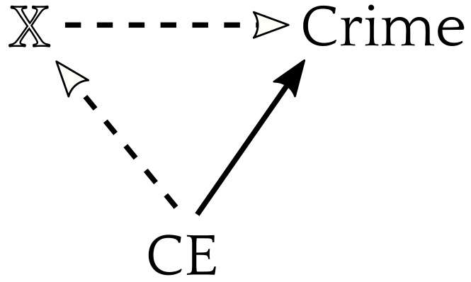
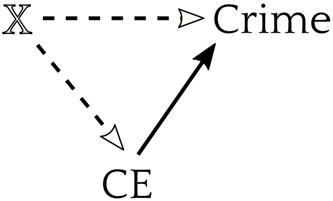
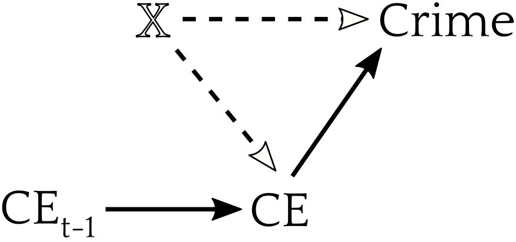
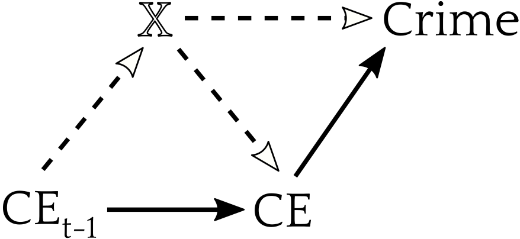
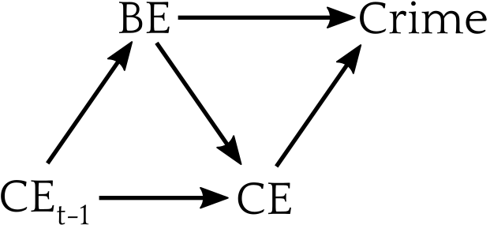
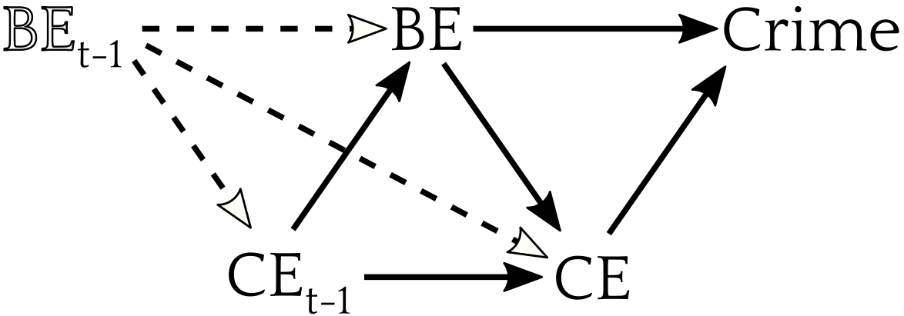
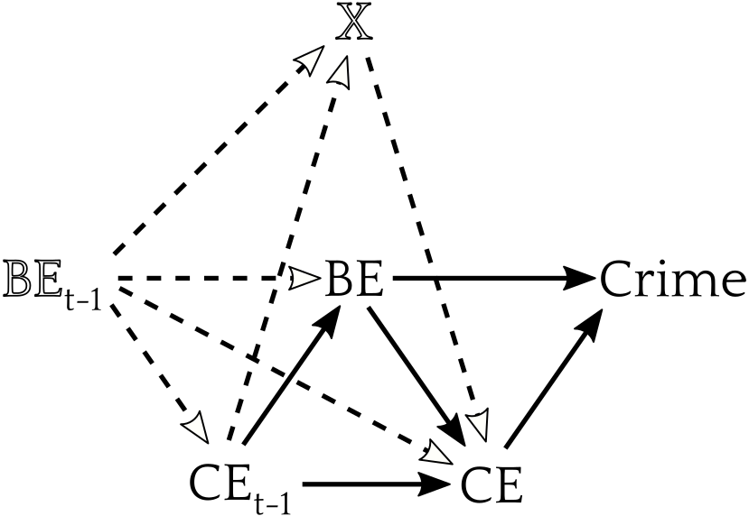
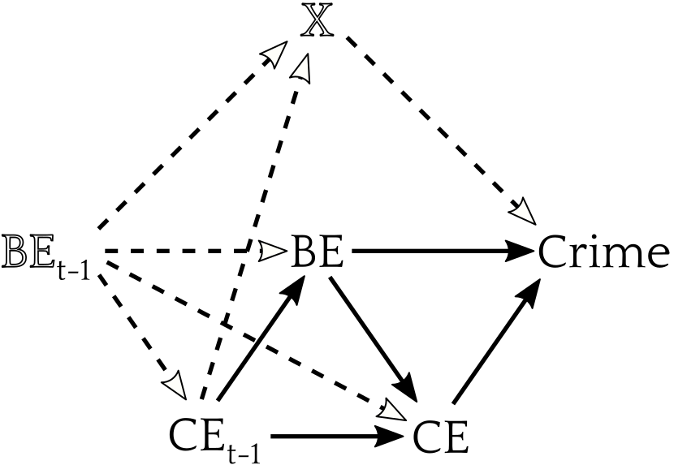

`r if(knitr:::is_latex_output()) '\\appendix'`

`r if(!knitr:::is_latex_output()) '# (APPENDIX) Appendix {-}'` 


# Data and Measurement Overview {#measures}

This appendix provides an overview of all data used in this dissertation as well as approaches used to derive composite measures from indicators (e.g., multilevel measurement models).

## Neighborhood Structural Measures

The social disorganization tradition recognizes crime and social control are rooted in structural characteristics of neighborhoods. To construct these measures, I obtained nine decennial census measures from the Longitudinal Tract Data Base (LTDB) [@loganInterpolatingDecennialCensus2014] based on those used by @sampsonNeighborhoodsViolentCrime1997a. The LTDB reweights indicators across changing boundaries between the 1990 and 2000 censuses to ensure they describe the same geographic areas. All measures are percentages and are listed in \@ref(tab:structurefactors). I use an oblimin-rotated alpha-scoring factor analysis to perform dimension reduction on these measures [@kaiserAlphaFactorAnalysis1965]. The factors were calculated simultaneously using both 1990 and 2001 observations for each NC to generate comparable measures over time. Three factors explain 87% of variation in the nine indicators and exhibit acceptable model fit ($\chi^{2}=7.69$, $df = 12$, $p=0.81$). Loadings are depicted in \@ref(tab:structurefactors).

```{r, echo=FALSE, ft.arraystretch = 0.8, ft.tabcolsep = 4}
factor_footer <- tibble::tribble(
  ~Measure,	                         ~Disadvantage,	~`Hispanic / Immigration`,	~Stability,
     "Eigenvalue",                      3.15, 2.74	,1.98,
   "Proportion of Variance Explained",0.35, 0.30	,0.22)

tibble::tribble(
  ~Measure,	                         ~Disadvantage,	~`Hispanic / Immigration`,	~Stability,
   "Under 18",                      	1.03, 0.25,  -0.13,
   "Unemployment",                    0.74, -0.33,	0.14,
   "Poverty",                         0.69, -0.15,	0.43,
   "Female-Headed Households",        0.67, -0.44,	0.27,
   "Home Ownership",                 -0.09, 0.02	,-0.96,
   "Moved in Last 10 Years",         -0.19, 0.34	,0.79,
   "Hispanic",                        0.30, 0.93	,0.05,
   "Foreign Born",                   -0.12, 0.83	,0.15,
   "Non-Hispanic Black",              0.43, -0.71,	-0.03) %>%
  flextable() %>% 
  add_footer_row(values = factor_footer[2,], colwidths = rep(1,4)) %>% 
  add_footer_row(values = factor_footer[1,], colwidths = rep(1,4)) %>%
  align(j = 2:4, align = "center", part = "all") %>%
  font(fontname = "Latin Modern Roman", part = "all") %>%
  hline_top(border = officer::fp_border(width = 1), part = "header") %>%
  hline_top(border = officer::fp_border(width = 0.5), part = "body") %>%
  hline_bottom(border = officer::fp_border(width = 0.5), part = "body") %>%
  hline_bottom(border = officer::fp_border(width = 1), part = "footer") %>%
  width(j = 1, width = 2) %>%
  width(j = 2:4, width = 1.2) %>% 
  set_caption(caption = "(\\#tab:structurefactors) Factor Loadings for Neighborhood Structural Measures")
```

Based on the indicators which most highly load on each factor, they are described as disadvantage, Hispanic / immigrant, and stability. Disadvantage loads primarily on under-18 population, unemployment, poverty, and female-headed households, and to a lesser-degree non-Hispanic black population. Hispanic / immigrant loads on Hispanic population, foreign born, and negatively on non-Hispanic black. Stability loads negatively on home ownership and positively on moves in the last 10 years. These were extracted as neighborhood-level correlation-preserving factor scores to produce a parsimonious set of structural predictors for use in subsequent models [@tenbergeNewResultsCorrelationpreserving1999].

While the measures were chosen to replicate the structural measures used in @sampsonNeighborhoodsViolentCrime1997a, one indicator for disadvantage—percent of families on public assistance—was not available in the LTDB. The indicator for recent moves is also in the last 10 years rather than 5 years. Even with these differences—and calculating across both waves simultaneously—the resultant factor scores for 1990 neighborhoods are all correlated at over $\rho=.95$ with those from @sampsonNeighborhoodsViolentCrime1997a.^[Another benefit of recalculating these factors is that the PHDCN-CS data has missing values on all neighborhood measures for one NC (749). Calculating new scores thus recovers one missing observation.]

## Neighborhood Social and Perceptual Measures

The neighborhood social and perceptual measures were calculated using multi-level measurement models which adjust for sociodemographic composition of neighborhoods and conservatively shrink estimates toward zero where interrater reliability is lower [@sampsonNeighborhoodsViolentCrime1997a]. These measures include collective efficacy, police efficacy, perceived violence, legal cynicism, violent victimization, and local ties and exchange. Violent victimization is a single binary indicator estimated with a logistic regression while the remaining measures feature multiple four- or five-category ordinal indicators estimated using linear regression. Multiple-indicator measures include dummies for each indicator to adjust for item difficulty and random respondent intercepts. All models feature neighborhood-level random intercepts which are extracted and used as in subsequent models as empirical Bayes estimates of the neighborhood measures. I use a single factor for Collective Efficacy which combines Cohesion and Trust and Informal Control Expectations to mimic existing work in this field and using these data. A two-factor solution is preferred in confirmatory factor models, though the resulting separate factors are highly correlated at both the individual ($\rho=0.70$ in 1995, $\rho=0.67$ in 2003) and neighborhood level ($\rho=0.71$ in 1995, $\rho=0.64$ in 2003).^[I could potentially fit alternate models using an interaction between the separate factors but it wouldn’t give any leverage on any questions I am interested in.]

\@ref(tab:structuremeasures) depicts all indicators used to calculate the neighborhood measures including loadings from confirmatory factor analyses and overall neighborhood-level measure reliability from each multilevel model. Bracketed loadings reflect loadings on separate Cohesion and Trust and Informal Control Expectations factors for comparison to the combined Collective Efficacy Factor. For measures with two indicators like friend and kinship ties, a polychoric correlation between the indicators is reported in parentheses instead of item loadings. Note some measures differ between the 1995 and 2003 surveys, in particular, the indicators for police efficacy. Dashes indicate missing indicators for a given survey.


```{r, echo=FALSE, ft.arraystretch = 0.8, ft.tabcolsep = 4}

tibble::tribble(~Measure, ~ Indicator, ~`PHDCN\n(1995)`, ~`CCAHS\n(2003)`,
"Collective Efficacy (Cohesion & Trust + Informal Control Expectations)",    "",	"A=0.758",       "A=0.503",
'Cohesion & Trust ("How much do you agree that…")',                          "",	"A=0.763",       "A=0.453",
"",	"People around here are willing to help their neighbors.",                  	"0.699 [0.766]", "0.775 [0.813]",
"",	"People in this neighborhood can be trusted.",	                              "0.726 [0.795]", "0.824 [0.881]",
"",	"This is a close-knit neighborhood.",	                                        "0.660 [0.707]", "0.624 [0.646]",
"",	"People in this neighborhood generally… get along with each other.",	        "0.515 [0.558]", "0.752 [0.799]",
"",	"People in the neighborhood… share the same values.",	                        "0.483 [0.521]", "0.751 [0.790]",
'Informal Control Expectations ("How likely is it…")', "", 	                                                                                                          "A=0.705", 	      "A=0.469",
"",	"If a group of neighborhood children were skipping school and hanging out on a street corner, how likely is it that your neighbors would do something about it?",	"0.708 [0.788]",	"0.652 [0.780]",
"",	"If some children were spray-painting graffiti on a local building, how likely is it that your neighbors would do something about it?",	                          "0.792 [0.874]",	"0.677 [0.811]",
"",	"If a child was showing disrespect to an adult, how likely is it that people in your neighborhood would scold that child?",	                                      "0.629 [0.705]",	"0.593 [0.689]",
"",	"If children were fighting out in the street, how likely is it that people in your neighborhood would stop it?",             	                                    "0.623 [0.681]",	"0.556 [0.644]",
"",	"Neighborhood residents would organize to keep closest fire station open if it were to be closed down by city because of budget cuts.",                         	"0.615 [0.652]",	"0.578 [0.653]",
"Police Efficacy & Legitimacy", "",	                                                                                                                "A=0.808",	"A=0.422",
"",	"Police in the neighborhood are responsive to local issues. (Strongly Agree to Strongly Disagree)",	                                            "0.787", "-",
"",	"Police are doing a good job in dealing with problems that really concern people in the neighborhood. (Strongly Agree to Strongly Disagree)",	  "0.863", "-",
"",	"Police are… doing a good job in preventing crime in the neighborhood. (Strongly Agree to Strongly Disagree)",	                                "0.597", "-",
"",	"Police do a good job in responding to people in the neighborhood after being victims of crime. (Strongly Agree to Strongly Disagree)",	        "0.584", "-",
"",	"Police are… able to maintain order on streets and sidewalks in the neighborhood. (Strongly Agree to Strongly Disagree)",	                      "0.585", "-",
"",	"In the past five years the level of police protection has gotten… (Better to Worse)",	                                                        "0.576", "-",
"",	"How much of a problem is police not patrolling the area or responding to calls from the area? (Major Problem to Not a Problem)",	              "0.792",	"-",
"",	"How much of a problem is excessive use of force by police? (Major Problem to Not a Problem)",	                                                "0.654",	"-",
"",	"How good a job are the police doing in working together with residents in your neighborhood to solve local problems? (Good to Poor)",	        "-",	"0.745",
"",	"The police are fair to all people regardless of their background. (Strongly Agree to Strongly Disagree)",	                                    "-",	"0.704",
"",	"The police in your local community can be trusted. (Strongly Agree to Strongly Disagree)",	                                                    "-",	"0.874",
'Legal Cynicism ("How much do you agree that…")', "",                                	"A=0.488",	"A=0.058",
"",	"Laws are made to be broken.",                                                   	"0.655",	"0.636",
"",	"It's okay to do anything you want so long as you don't hurt anyone.",           	"0.643",	"0.586",
"",	"To make it there are no right and wrong ways anymore, only easy and hard ways.",	"0.695",	"0.754",
"",	"Fighting between friends or within families is nobody else's business",	        "0.399",	"-",
"",	"Nowadays a person has to live for today and let tomorrow take care of itself.",	"0.569",	"0.616",
'Perceived Violence  ("During the past 6 months, how often was there…")' , "", "A=0.828",	"A=0.647",
"",	"A fight in this neighborhood in which a weapon was used?",	               "0.894",	"0.878",
"",	"A violent argument between neighbors?",	                           	     "0.755",	"0.769",
"",	"Gang fights?",                                                      	     "0.918",	"0.901",
"",	"A sexual assault or rape?",                           	                   "0.677",	"0.749",
"",	"A robbery or mugging?",                                                   "0.702",	"0.693",
"Violent Victimization", "",                           	                                                                                       		"A=0.474",	"A=0.345",
"",	"While you've lived in this neighborhood, has anyone ever used violence against you or any household member anywhere in your neighborhood?",	"1",	"1",
'Local Exchange ("How often do you and other people in the neighborhood…"' ,"",	             	"A=0.601",	"A=0.363",
"","	… do favors for each other?",	                                                      		"0.832",	"0.803",
"",	"When a neighbor is not at home… do you and other neighbors watch over their property?",	"0.773",	"0.748",
"",	"… each other advice about personal things?",	                           	                "0.684",	"0.716",
"",	"… have get-togethers where other people in neighborhood are invited?",	                  "0.613",	"0.620",
"",	"… visit in each other's homes or on the street?",                                    		"0.709",	"0.723",
"Kinship/Friendship Ties", "",                           	              "A=0.768",	"A=0.564",
"",	"How many of your relative or in-laws live in your neighborhood?",	"(0.31)",	"(0.24)",
"",	"How many friends do you have in your neighborhood?",               "(0.31)",	"(0.24)",
"Attachment", "",	                           	                                  	 "A=0.766",	"Unavail.",
"",	"Do you like or dislike this neighborhood as a place to live?",                "(0.62)",	"-",
"",	"If you had to move from this neighborhood, would you miss the neighborhood?", "(0.62)",	"-"
) %>%
  flextable() %>%
  merge_h_range(i = ~ Measure!="", j1 = 1, j2 = 2) %>%
  set_header_labels(Measure = "Measure / Indicator", Indicator = "", `PHDCN\n(1995)` = "PHDCN\n(1995)") %>%
  merge_h_range(i = 1, j1 = 1, j2 = 2, part = "header") %>%
  fontsize(size = 9, part = "all") %>%
  set_table_properties(layout = "fixed") %>%
  border_remove() %>%
  width(j = 1, width = 0.2) %>%
  width(j = 2, width = 3) %>% 
  width(j = 3:4, width = 1) %>%
  add_header(Measure = "", Indicator="", `PHDCN\n(1995)`="Loadings / Reliabilites (A)", `CCAHS\n(2003)`="CCAHS\n(2003)") %>%
  merge_h_range(i = 1, j1 = 3, j2 = 4, part = "header") %>%
  align(j = 3:4, align = "center", part = "all") %>%
  font(fontname = "Latin Modern Roman", part = "all") %>%
  hline_top(border = officer::fp_border(width = 1), part = "header") %>%
  hline_bottom(j = 3:4, border = officer::fp_border(width = 0.5), part = "header") %>%
  hline_top(border = officer::fp_border(width = 0.5)) %>%
  hline_bottom(border = officer::fp_border(width = 0.5), part = "body") %>%
  hline_bottom(border = officer::fp_border(width = 1), part = "footer") %>%
  set_caption(caption = "(\\#tab:structuremeasures) Loadings and Reliabilities for Neighborhood Perceptual Measures")
 
```

## Crime Data

Two additional sources of crime measure were used: (1) the aggregated restricted access PHDCN-CS which includes the violent crime and homicide measures used by @sampsonNeighborhoodsViolentCrime1997a, and (2) publicly-available geocoded Chicago Police Department (CPD) crime data for the three years after the CCAHS [@Crimes2001Present2020]. The PHDCN-CS measures are provided as raw counts of incidents at the NC level. The geocoded CPD crime data permit constructing measure of crime incidents for smaller geographies such as the census blocks used in Chapter \@ref(builtenvironment). Similar block-level crime data are not available for the years following the 1995 PHDCN-CS, preventing construction of a block-level two-wave panel. Full descriptives for crime data are provided in each chapter.

# Identification Problems in Neighborhood Studies {#identification}

This appendix provides an extended discussion of threats to causal identification in studies of neighborhood crime. It is based in part on the similar but shorter discussion in @lanfearBrokenWindowsInformal2020, and draws heavily on 

## Potential Outcomes

This dissertation is concerned with the effect of social and physical characteristics of neighborhoods on crime. The potential outcomes causality framework applies the language of randomized controlled experiments to general questions of causal inference. This framework is useful for describing problems related to estimating causal effects in neighborhood crime and social control, the focus of this dissertation. For simplicity, this framework is typically illustrated, as here, with a binary treatment ($T = \{0,1\}$), but it generalizes to multi-valued treatments. In this framework, $\tau_i$, the causal effect of a treatment on unit $i$ is defined as the difference between two potential outcomes: The outcome that would be observed if the unit receives the treatment ($Y_i(1)$) and the outcome that would be observed if the unit does not receive the treatment ($Y_i(0)$). Equation 1 depicts the unit treatment effect:

\begin{equation}
\tau_i  = Y_i(1) \:–\: Y_i(0)
(\#eq:unittreateffect)
\end{equation}

The fundamental problem of causal inference is that we only observe one of these potential outcomes for any given unit [@hollandStatisticsCausalInference1986]. This renders estimation of the individual causal effect impossible—the individual causal effect is unidentified. If, however, treatment assignment is independent of these potential outcomes ($\{Y_i(0), Y_i(1)\} \perp\!\!\!\perp T_i$) we can estimate the average treatment effect (ATE) as the average difference in outcome between treated and untreated units:


\begin{equation}
\begin{split}
ATE & = E(Y_i(1) \:–\: Y_i(0))\\
& = E(Y_i(1)) \:–\: E(Y_i(0))\\
& = E(Y_i|T_i=1) \:–\: E(Y_i|T_i=0)
\end{split}
(\#eq:ate)
\end{equation}

To achieve identification in this manner, a series of assumptions must be made. The first key assumption is ignorability of treatment assignment, and the second is the stable unit treatment value assumption (SUTVA) [@rubinComment1986], which has two components: consistency and absence of interference.

### Ignorability

Ignorability is the assumption of independence between potential outcomes and treatment—that is, units of the treated group are not systematically affected  more or less by treatment than would be the untreated. Equation \@ref(eq:ignorability) shows this assumption:

\begin{equation}
\{Y_i(0), Y_i(1)\} \perp\!\!\!\perp T_i
(\#eq:ignorability)
\end{equation}

Ignorability does not rule out heterogeneity in treatment effects, but does require this heterogeneity be independent of treatment assignment. Ignorability may be satisfied with randomization as in a controlled experiment, but is unlikely to hold in observational research due to selection or confounding. In situations such as these, it may be possible to achieve ignorability by conditioning on all pre-treatment covariates $X$ which predict both treatment and the outcome:

\begin{equation}
\{Y_i(0), Y_i(1)\} \perp\!\!\!\perp T_i | X_i,\; 0 < Pr(T_i = t | X_i) < 1
(\#eq:strongignorability)
\end{equation}

The assumption shown in equation 4 is termed “strong ignorability” given covariates, which further requires positive probability of treatment at all levels of $X$. Controlling for all relevant pre-treatment covariates ($X$) is the primary difficulty for establishing causality in observational studies. Provided ignorability given covariates, we may estimate the conditional average treatment effect (CATE) as the expected value of equation 2—the average difference between treatment groups conditional on covariates.

### Mediation and Sequential Ignorability

We may be interested in estimating the indirect effect of a treatment on an outcome via some mediator or mechanism, such as the effect of collective efficacy on crime via changes in the built environment .

\begin{equation}
\delta_i(t) = Y_i(t, M_i(1)) \:–\: Y_i(t, M_i(0))
(\#eq:mediationeffect)
\end{equation}

Equation \@ref(eq:mediationeffect) is the causal mediation effect, which is the difference in the outcome that would be observed due to the change in the value of the mediator occurring from treatment while holding treatment status ($t$) constant. Note the indirect effect includes additional potential outcomes—the mediator counterfactuals—that are never observed, and if there is no effect of treatment on the mediator $M_i(1) = M_i(0)$, there is no causal mediation effect. In causal mediation analysis, there are two additional causal effects of interest:

\begin{equation}
\zeta_i(t) = Y_i(1, M_i(t)) \:–\: Y_i(0, M_i(t))
(\#eq:cde)
\end{equation}

\begin{equation}
\tau_i =  (Y_i(1, M_i(1)) \:–\: Y_i(0, M_i(0))
(\#eq:te)
\end{equation}


Equation \@ref(eq:cde) is the causal direct effect (CDE), defined as all effects of the treatment on the outcome occurring through causal mechanisms other than the mediator. Equation \@ref(eq:te) is the total effect, defined as the sum of the causal mediation effect and the causal direct effect, assuming no interaction between treatment and mediator. Note the total effect in mediation analysis is equivalent to the unit treatment effect (Equation \@ref(eq:ate)). Mediation analysis is a form of causal effect decomposition [@vanderweeleUnificationMediationInteraction2014].

Consistent estimation of these causal effects requires extending the ignorability assumption into an assumption of sequential ignorability . This requires that the treatment assignment is ignorable, as before, conditional on included pretreatment covariates. It also requires that assignment of the mediator is ignorable conditional on both the treatment and included pretreatment confounders. Given $X_i$ is a vector of observed pretreatment confounders, equations \@ref(eq:treatmentignorability) and \@ref(eq:mediatorignorability) define sequential ignorability [@imaiIdentificationInferenceSensitivity2010], provided non-zero probability of both treatment and mediator at all levels of their antecedent variables.

\begin{equation}
\{ Y_i(t',m), M_i(t) \} \perp\!\!\!\perp T_i | X_i = x,\; 0 < Pr(T_i = t | X_i = x) < 1
(\#eq:treatmentignorability)
\end{equation}

\begin{equation}
Y_i(t',m) \perp\!\!\!\perp M_i(t) | T_i = t, X_i = x,\; 0 < Pr(M_i = m | T_i = t, X_i = x) < 1
(\#eq:mediatorignorability)
\end{equation}

Even under randomized treatment, equation \@ref(eq:mediatorignorability)—mediator ignorability—is a strong and generally untestable assumption. In an observational setting, this is an especially strong assumption. @imaiIdentificationInferenceSensitivity2010 suggest using tests to estimate the sensitivity of causal mediation results to omitted confounders. @imaiWhenShouldWe2019 also show that the sequential ignorability assumption applies to causal inference in panel models using unit fixed-effects to adjust for omitted time-invariant confounders. In that setting, the treatment in each time period must be ignorable conditional on all prior treatment levels of the unit. Potential feedback between outcomes in one period and treatments and confounders in subsequent periods render identification challenging.

Models with multiple mediators also present a challenge to identification as conventional approaches are biased when mediators are correlated or interact with one-another. When these occur the individual pathways effects may not be identifiable at all even if sequential ignorability is otherwise satisfied [@vanderweeleExplanationCausalInference2015]. This dissertation features one analysis with multiple mediators: an estimation of the effect of past collective efficacy on present crime via multiple features of the built environment as well as present collective efficacy. Typical mediation approaches make the assumption of no interaction between mediators—these may be unrealistic if, for instance, criminogenic elements of the built environment display concentration effects or their effects interact with present collective efficacy. 

In this dissertation, I use structural equations for my mediation analyses. These models make the assumption of no interaction between mediators and additionally assume linearity in exposure-mediator and mediator-outcome relationships. The causal mediation approach of [@imaiIdentificationInferenceSensitivity2010] is may be used as a robustness test as it relaxes the linearity assumption by permitting arbitrary functional forms but it is unsuitable in the present work as it does not permit estimation with multiple mediator paths. [@vanderweeleExplanationCausalInference2015] suggests an inverse probability weighting approach to estimate average direct and indirect effects in the presence of multiple interacting mediators. This method performs poorly with continuous treatments—such as collective efficacy—making it inapplicable to the present analyses [@vanderweeleExplanationCausalInference2015].

### Consistency

Consistency is the assumption that the mechanism by which treatment is assigned can be ignored because the potential outcomes for units are independent of different treatment mechanisms. This assumption may also be stated as there being (1) no difference in potential outcomes within units across different version of any particular treatment level, or (2) only one unique form of each treatment level. This assumption is problematic for experiments where a researcher-assigned treatment may differ from the real-world treatment it is meant to mimic. It may also occur in observational research as a measurement problem where a given value of the treatment corresponds to different actual treatments or dosages. Note this is not equivalent to treatment effect heterogeneity. In treatment heterogeneity, the potential outcomes are fixed for individual units. Under a consistency violation, units are receiving different treatments with different unit-specific potential outcomes despite having the same measured treatment status. In observational designs, consistency is generally untestable but must be assumed to make causal inferences—a controversial problem in the statistics literature [@vanderweeleExplanationCausalInference2015]. One benefit to adherence to Holland and Rubin’s oft-derided motto "no causation without manipulation" is that clarity with regard to the (at least theoretical) manipulation under consideration helps mitigate consistency violations [@hernanCompoundTreatmentsTransportability2011]. 

### No Interference

The assumption of no interference requires that treatment assignment of one unit does not affect the outcomes of other units:

\begin{equation}
\{Y_i(0), Y_i(1)\} \perp\!\!\!\perp T_j, i \neq j
\end{equation}

Two forms of interference are common when examining neighborhood processes: direct and via contagion [@ogburnCausalDiagramsInterference2014]. The difference between direct interference and interference via contagion is whether the effect of unit $i$’s treatment on unit j’s outcome is mediated by the outcome of unit i. Direct interference occurs when treatment of a unit directly affects the outcome of another unit: treatment of unit $i$ essentially also treats unit $j$. For example , high collective efficacy in one neighborhood might produce guardianship for a nearby neighborhood which directly reduces violence there. Interference may also occur through contagion, in which the outcome of a treated unit—instead of the treatment itself—affects the outcome of another unit. For example, if high collective efficacy reduces violence in the focal neighborhood but that lowers retaliatory violence in a nearby neighborhood.

These two forms of interference may produce seemingly equivalent outcomes, but the differences between these forms of interference are consequential for theory and modeling. Interference may be addressed by modeling the interference process, such as with an exogenous spatial lag for direct interference or an endogenous lag for interference by contagion. Accounting for interference is important as it has been found empirically in studies of collective efficacy [@morenoffNeighborhoodInequalityCollective2001] and is explicitly assumed by the cascade mechanisms in broken windows. 

## Specific Issues

There are a number of prominent threats to identification in the analyses in this dissertation. I first focus on threats to ignorability, specifically key omitted variables, apparent reverse causality or reciprocality, and the related issue of how quickly causal processes operate. Then I discuss potential consistency violations and sources of interference.

### Omitted Variables

Causal research on neighborhood crime has typically focused on relationships between informal social control (e.g. collective efficacy), crime, and disorder [@lanfearBrokenWindowsInformal2020]. Routine activity theory provides a useful language for considering omitted variables which may compromise identification of these relationships. Confounding is likely to occur if a model omits any variable that is related to the treatment and which influences the three necessary elements of predatory crimes—likely offenders, suitable targets, and capable guardians. In this dissertation, I suggest elements of the built environment which provide targets, attract offenders, and inhibit guardians are key omitted variables in neighborhood studies of crime. I hypothesize that these sources of opportunities are causally descended from collective efficacy because residents act collectively to eliminate what they recognize as criminogenic contexts. Because the built environment is slow to change, I expect this to be an effect with substantial lag time. The presence of criminogenic contexts may also influence neighborhood collective efficacy or moderate its effects on crime by presenting formidable or even intractable challenges. This effect should be immediate as evaluations of collective efficacy will take into account challenges that impact how effective collective action is likely to be.

Some studies have introduced additional social factors such as legal cynicism or police legitimacy [@kirkLegalCynicismCollective2011; @sampsonLegalCynicismSubcultural1998] and [@andersonCodeStreetDecency2000] “code of the street” [@matsuedaRaceNeighborhoodCodes2006]. On the one hand, their findings suggest it may be important to adjust for these to identify causal effects of informal social control. On the other, their designs typically cannot adjudicate between these variables being confounders or mediators of informal social control: causal directionality is established by assumption based on theory rather than tested empirically. If the direction of causality is different than assumed—such as when they operate as mediators—adjusting for these variables may introduce bias into estimates rather than reduce it. In this dissertation,  I evaluate the role of police legitimacy and effectiveness in the neighborhood crime control system, combining the two into a police efficacy construct. While my theoretical framework suggests police efficacy precedes and moderates collective efficacy, I use repeated observations to evaluate the direction of effects.

In most analyses in this dissertation I must necessarily make the assumption that there are no other relevant omitted variables compromising identification. This is a strong assumption  in complex systems like neighborhoods, but all effort has been made to include predictors implicated by neighborhood and place theories of crime—and to do so with careful attention to measurement and causal ordering. More problematic are potential omitted variables confounding the relationship between collective efficacy and the built environment—a relationship which has not been explored in past research. Processes operating at the metro level may generate confounding by differentially allocating investment and resultant development to neighborhoods [@dreierPlaceMattersMetropolitics2014; @loganUrbanFortunesPolitical2007].  

Sensitivity tests for evaluating the threat of confounding are another approach to addressing omitted confounders. For example, @hardingCounterfactualModelsNeighborhood2003, demonstrates a process in which he (1) simulates unobserved confounders with varying correlations with treatment and outcome, (2) determines how strong these relationships would need to be to invalidate his primary findings, and (3) evaluates the plausibility of the existence of these omitted confounders in light of observed covariates with comparable associations. Such sensitivity tests represent recognition that the focal causal effect may not be precisely identified due to omitted variables, but may be unlikely to be zero or of the opposite sign. In the last section of this chapter I use directed acyclic graphs to illustrate other scenarios for which sensitivity tests may be conducted to evaluate the threat to identification presented by omitted variables.

### Reverse Causality

The presence of reciprocal pathways presents another potential threat to ignorability in neighborhood studies of crime. Broken windows, collective efficacy, and routine activity theories all feature some degree of reciprocality between their key causal factors. Broken windows states that informal social control is the primary mechanism restraining disorder, but pervasive disorder reduces social control capacity [@wilsonBrokenWindows1982]. Collective efficacy is commonly described as a fully recursive model, though @sampsonSystematicSocialObservation1999 and @sampsonGreatAmericanCity2012 acknowledge crime feeds back directly on collective efficacy, possibly through fear or cynicism. In the original presentation of routine activity theory, @cohenSocialChangeCrime1979 describe a reciprocal relationship between predatory patterns of likely offenders and protective behaviors by potential targets, which evokes game theoretic approaches. In all cases, positive reciprocal effects will inflate estimates, while negative reciprocal effects will attenuate them. In either case, the causal relationship is not identified.

This concern may be addressed by considering micro-macro transitions and the necessary temporal ordering for these to occur. For example, broken windows specifies neighborhood-level mechanisms which are mediated by individual perception and action. Neighborhood disorder causes crime only by signaling low social control. Perceived low social control induces either offending or self-protective behavior in individuals. Self-protective behavior reduces actual social control, and thus induces offending as well. Changes in crime rates and quantity of neighborhood disorder are the aggregation of these individual behaviors. Temporal ordering and inter-level transitions resolve the apparent reciprocality problem.

Consider also collective efficacy’s reciprocal relationship with crime. This process is temporally ordered and occurs through lower-level processes. Collective efficacy inhibits crime through interventions or offender decision-making, while crime inhibits collective efficacy through fear or cynicism. For both broken windows and collective efficacy, these effects can be estimated using repeated observations at the neighborhood level or observations of the intervening individual-level mechanisms. In the acyclic graph section of this subchapter I illustrate the use of repeated observations to address reverse causality.

A related but more problematic form of reverse causality is in the source of resident perceptions of collective efficacy. Results from multiple studies suggest that residents—at least in part—infer levels of collective efficacy based on observed crime and disorder [@hippCollectiveEfficacyHow2016; @matsuedaMeasuringCollectiveEfficacy2016]. Again, if the individual-level mechanism can be measured reverse causality can be addressed in the measurement stage as done by @matsuedaMeasuringCollectiveEfficacy2016. If this cannot be done at the individual level, reverse causality can be modeled at the neighborhood level but it will remain ambiguous if observed feedback is due to individual updating of expectations for others’ social control interventions or a suppressive effect of crime on actual intervention propensity.

### Temporal Considerations

If relying on temporal order to resolve reverse causality, an important question is how quickly different causal pathways operate over time [see @taylorCommunityCriminologyFundamentals2015]. I propose collective efficacy controls crime immediately via informal control but also has a lagged effect by altering criminal opportunities in the built environment. Both of these processes occur simultaneously and continuously. Collective efficacy is conventionally described as a capacity for direct interventions against deviance [@sampsonNeighborhoodsViolentCrime1997a]. These interventions are immediate and aimed at stopping an ongoing or imminent activity. When interventions, or the perceived threat thereof, cease, so will their protective power.

In contrast, interventions via the built environment occur slowly  but have enduring consequences. These interventions target recurrent unwanted activity or the threat of such. If successful, they can entirely remove the potential for these activities to occur. For example, collective action that shuts down a problem bar or clears a vacant lot might reduce crime on that block for years afterward. If collective efficacy declines in the future, it may reduce the likelihood of direct interventions but the problem bar or vacant lot does not immediately return. In this way, collective efficacy in the past may be as consequential as present levels for determining rates of crime. If this is accurate, I expect the present state of the built environment to mediate the effect of past collective efficacy on crime.

A related set of empirical questions—which I do not examine in this dissertation—are how long are the appropriate time lags for these effects and do they vary systematically across neighborhoods [see @taylorCommunityCriminologyFundamentals2015 for an extended discussion].  Consider the direct effect of collective efficacy. Collective efficacy is assumed to reduce crime in neighborhoods at least in part through a deterrence or normative mechanism: likely offenders refrain from attempting crime because they perceive the neighborhood has capable guardians. An important question is whether likely offender perceptions of collective efficacy closely mirror those of residents, or is there a substantial lag between those perceptions? If their perception of guardianship is rooted in the past—such as if offenders update perceptions slowly—it may induce an effect of past collective efficacy not blocked by present collective efficacy or the built environment. We might consider this a reputational effect which would complicate estimation of causal effects of present collective efficacy.

As a final note on temporal considerations, it is important to state that over a sufficiently long period, every neighborhood social and physical characteristic is endogenous. This is because actors recognize the relationship between perceived problems and physical and social characteristics of neighborhoods—and they act to address both the problems and what they perceive as their underlying causes. And, when problems appear intractable, residents cease making interventions and those able to do so are likely to leave the neighborhood. A primary argument of this dissertation is that the capability to act efficaciously to address perceived problems is a key mechanism relating social structural (dis)advantage to crime, disorder, and neighborhood change.

### Measurement and Consistency

The prior discussion raises the broader question: from where do perceptions of collective efficacy emerge?. Research focusing on residents suggests these perceptions are at least in part drawn from their observations of crime and disorder [e.g., @hippCollectiveEfficacyHow2016; @matsuedaMeasuringCollectiveEfficacy2016]. Residents who observe crime and disorder infer control capacity is weak, and those who observe their absence infer control capacity is strong. Less is known about offender perceptions, which are particularly consequential if collective efficacy inhibits crime via deterrence. Sampson, Morenoff, & Earls [-@sampsonSocialCapitalSpatial1999, p. 657], for example, suggest children know levels of child-centered control better than the adults from which surveys typically obtain measurements. Given evidence that most offending occurs near where offenders live [@bernascoModelingMicroLevelCrime2010] or are otherwise familiar [@carterCriminalImageCity1979], likely offenders should have at least as accurate perceptions of social control capacity as residents. If likely offenders are better informed than residents, then conventionally measured collective efficacy is a contemporaneous—or even lagging indicator of social control capacity. This would close the reputational effect’s backdoor causal path, permitting use of a lagged of collective efficacy as an instrument for present collective efficacy so long as any other mediating path is closed, such as the built environment. 

This raises a secondary measurement problem. Consider if some unobserved built environment features are related to present collective efficacy and mediate past collective efficacy’s effect on crime. For example, suppose past collective efficacy is causally related to current prevalence of street lights which inhibit crime.  In this case, street lights will be an unobserved confounder preventing identification of the causal effects of present collective efficacy and the built environment on crime. This issue is further illustrated in the section on causal graphs at the end of this chapter.

In observational research, consistency is closely related to measurement. Because the researcher is not assigning a treatment to the exposed units, there is little worry that the treatment in question is an unrealistic approximation of “real world” treatment of interest. A greater concern is that a single level of the treatment may in fact represent different treatments. This dissertation proposes that conflicting evidence for causal effects of disorder on crime may in part be due to this form of consistency violation. Effects of disorder on crime are typically estimated based on variation in composite measures of multiple forms of disorder. In these composite measures, different configurations of disorder may result in the same measured value of the treatment. If each form of disorder produces a different criminogenic effect, it represents a consistency violation preventing identification of the treatment effect of interest. I address this problem by separating forms of physical disorder found in the built environment—such as abandoned buildings and vacant lots—into different measures, rather than combining them into indices as is common in this literature [e.g. @sampsonSystematicSocialObservation1999].


### Interference

Interference is a notable threat to causal inference in neighborhood research. The first potential source of interference is due to the mismatch between boundaries used as analytical units and “real” physical or social boundaries [@sampsonSocialCapitalSpatial1999; @taylorCommunityCriminologyFundamentals2015]. Spatial mismatches may result in units of analysis containing portions of both treated units and untreated units. This is a measurement problem in that it introduces bias into estimates by contaminating measures of some units with those from other units. While similar to other forms of interference in the manner it produces bias and in statistical methods which may be applied to address it, it differs in being induced by incorrect measurement rather than actual contagion or spillover effects. Unlike other forms of interference, in theory this might be addressed by using correct spatial units—though arguably a single correct spatial unit may not exist at all for neighborhoods, given the unavoidable presence of both social and spatial determinants in boundary-making practices.

Mobility of offenders is another plausible source of spatial dependence, but not necessarily interference. While offenders commit more crimes near home than far away, a substantial number of offenses still occur in locations distant from their residences [@bernascoModelingMicroLevelCrime2010; @carterCriminalImageCity1979]. If likely offenders radiate outward from their residences at random, it will result in dependence between crime in a focal unit and structural sources of motivation in nearby areas which decays with distance. This is commonly modeled with spatial error or, as done in this dissertation, spatial lag models. It is unlikely offenders only radiate outward at random, however.  It is more likely they follow—like any other actors—efficient paths like major roads and public transit lines [e.g. @brantinghamEnvironmentalCriminology1981]. A developing area of research suggests digital trace data or novel survey methods may address this by permitting estimation of stocks and flows of people in and between neighborhoods [@browningHumanMobilityCrime2021].

This offender mobility will produce interference if it is in some way induced by the treatment in question—collective efficacy, the built environment—either directly or via crime rates. For example, a body of work suggests violence, particularly gang-related violence, is often retaliatory in nature [@blockViolentCrimeEnvironment1977]. The presence of rival gangs in different neighborhoods may induce interference by contagion in measures of violent crime. This will occur if collective efficacy reduces violence in one neighborhood which results in an elimination of subsequent retaliatory violence in another neighborhood. Note that this form of interference is closely related to offender mobility, as retaliatory violence may involve offenders traveling to other neighborhoods either for the initial attack or the retaliation. Consequently, it is possible—even likely—that both forms of interference occur at the same time.

It is also likely that, if engaged in a search process for opportunities, likely  offenders will seek out areas likely to be target rich and guardian poor. Drawing from rational choice criminology [@cornishReasoningCriminalRational1986], what qualifies as target rich or guardian poor depends on the crime: for robbery, this may be poorly lit areas with cash-focused businesses, but for burglary it may be residential neighborhoods with single-family homes unoccupied during work hours. If likely offenders travel to reach areas of high opportunity, it is likely they will be engaged in at least a passive search process during their travel. This may result in direct interference which increases crime along travel routes to the high opportunity location. A particularly high opportunity place may also exert negative interference if the opportunities presented are sufficient to cause offenders in nearby areas to ignore inferior local opportunities. In this way features of the built environment may generate interference in part via the target selection or search process of likely offenders [@browningHumanMobilityCrime2021].

Lastly, research on spatial neighborhood effects suggests collective efficacy exerts beneficial effects in adjacent neighborhoods  [@sampsonGreatAmericanCity2012; @sampsonSocialCapitalSpatial1999]. The mechanism for this spatial effect has not—to my knowledge—been elaborated. If it exists, it may operate through the processes already described, such as reducing initial and thus retaliatory violence or impeding offender mobility [e.g. @greenbergSafetyUrbanNeighborhoods1982]. Another possibility lies in mobility of residents: As with likely offender mobility, if residents travel beyond their neighborhood but engage in interventions at least partly based on the collective efficacy of their home neighborhood, it could induce direct interference. Testing this hypothesis would require collecting new data on intervention behaviors of residents outside their neighborhoods, but adjusting for it statistically could potentially be accomplished with a spatial lag of collective efficacy—though the mechanism would remain ambiguous.

## Directed Acyclic Graphs  and Ignorability

Directed acyclic graphs (DAGs) provide a useful for tool for demonstrating potential violations of ignorability. The following diagrams depict observed variables in black text and estimable relationships between them in solid black arrows. Unobserved variables are in outlined text and relationships involving unobserved variables are in dashed lines to indicate they cannot be estimated. Pathways which are identified in a DAG are typically non-parametrically identified—that is, they are agnostic to functional forms and the presence of interactions. This discussion focuses on relationships within and between neighborhoods—in line with the main theories under examination in this work—but similar issues apply for different units and at different scales. Even restricted to the level of neighborhoods, this discussion is not exhaustive: neighborhoods are complex systems featuring many processes occurring simultaneously. They cannot all be considered at once, but I believe I consider those most relevant to the question of how the built environment mediates the effect of collective efficacy on crime. While DAGs may be applied to interference problems [e.g. @ogburnCausalDiagramsInterference2014], I do not illustrate interference in this section as it provides little additional clarity over the prior section.

```{r dag1, echo=FALSE, fig.align='center', out.width="40%", fig.cap="An omitted mediator"}

```

Figure \@ref(fig:dag1) depicts a simple model where collective efficacy predicts crime directly and through one or more unobserved mediators ($X$). For simplicity, assume adjustment for relevant variables which precede collective efficacy and influence crime. In Figure \@ref(fig:dag1), the omitted variable is only a mediator between collective efficacy and crime. Omitting it has no consequence for estimating the total effect of collective efficacy on crime, but including the omitted variable would increase explained variance and tell us more about how collective efficacy influences crime—the omitted variable can be considered a causal mechanism. For the full mediated causal path to be identified, assignment of the treatment ($CE$) and the mediator ($X$) must satisfy sequential ignorability. There are many candidates for omitted (but inconsequential) mediators, but the present work focuses on criminal opportunities, particularly criminogenic features of the built environment.

```{r dag2, echo=FALSE, fig.align='center', out.width="40%", fig.cap="Spuriousness"}

```

Figure \@ref(fig:dag2) includes the same variables but inverts the direction of causality between collective efficacy and the omitted measure. $X$ is now a preceding omitted variable which renders the relationship between collective efficacy and crime partly spurious. This variable must be adjusted for to identify the causal effect of interest. The present work suggests criminogenic features of the built environment as a candidate for these immediate effects on crime and collective efficacy. Because the built environment changes slowly, it is not a plausible mediator for present collective efficacy, though it may moderate its effects. Social factors like legal cynicism or satisfaction with police [@kirkLegalCynicismCollective2011; @sampsonLegalCynicismSubcultural1998] may also occupy this role, though they could just as plausibly be mediators for collective efficacy or simply share the same antecedents. Adjudicating between different causal directions requires repeated observations or instrumental variables. 

```{r dag3, echo=FALSE, fig.align='center', out.width="50%", fig.cap="A valid instrument"}

```

If ignorability cannot be achieved by directly conditioning on all relevant variables—that is some source of spuriousness is unobserved—identification can be achieved using an instrumental variable. Figure \@ref(fig:dag3) uses past collective efficacy as an example under the assumption that the only pathway by which past collective efficacy impacts crime is via present collective efficacy or included controls (again, hidden for simplicity). This is a strong and generally untestable assumption. Instrumental variables also assume a monotonic relationship between instrument and treatment. The estimated causal effect provided an instrument is restricted to the subsample for which the instrument induced a change in the treatment—the local average treatment effect (LATE), sometimes called the complier average causal effect. 

As an example of instrumental variables, @sampsonSystematicSocialObservation1999 used a series of models with (1) reciprocated exchange and resident attachment to the neighborhood as instruments for collective efficacy, (2) mixed land use as an instrument for disorder, and (3) prior homicide as an instrument for present homicide and robbery. Using these instruments makes the strong assumptions that (1) reciprocated exchange and attachment do not influence crime or disorder through any pathways other than via collective efficacy, (2) mixed land use does not influence crime or collective efficacy except via disorder, and (3) prior homicide does not influence disorder or crime except via present homicide. The present work and recent research by others suggest mixed land use directly influences crime [@woMixedLandUse2019] and prior crime depresses collective efficacy [@sampsonGreatAmericanCity2012]. Due to the interdependence of neighborhood processes, instrumental variables are not a promising route to causal identification unless they are produced via interventions.

```{r dag4, echo=FALSE, fig.align='center', out.width="50%", fig.cap="Exclusion restriction violation"}

```

Figure \@ref(fig:dag4) depicts a violation of the exclusion assumption in which past collective efficacy causes one or more of the relevant omitted variables. In this case, use of the instrument will not identify the effect of present collective efficacy on crime because of the backdoor path via $X$. The present work suggests some characteristics of the built environment occupy the role of $X$ here by presenting opportunities which facilitate crime while impacting present collective efficacy—but these opportunities may be removed due to collective action of residents, making them dependent on past collective efficacy. While the direct effect of collective efficacy on crime is not identified here, the total effect of past collective efficacy is because the omitted path is entirely descended from past collective efficacy.


```{r dag45, echo=FALSE, fig.align='center', out.width="50%", fig.cap="Mediation model"}

```

If we observe and include the previously omitted mediator, we arrive at Figure \@ref(fig:dag45). In this model, the effect of present collective efficacy on crime is identified as is the mediation of past collective efficacy through the built environment. Note here the built environment serves as a post-treatment confounder for present collective efficacy which violates sequential ignorability [@imaiUnpackingBlackBox2011]. Adjusting for the built environment is required to identify the path from present collective efficacy to crime but doing so introduces bias into the estimated intertemporal collective efficacy path. The mediated effect of past collective efficacy on crime via present collective efficacy is thus unidentified. Even in a system with no unobserved variables, some causal effects may not be estimable without making additional assumptions, such as treatment homogeneity [@imaiUnpackingBlackBox2011].


```{r dag5, echo=FALSE, fig.align='center', out.width="60%", fig.cap="A seemingly valid specification"}

```

Including the relevant omitted variables—here the built environment—can close the problematic pathways and render our effect of interest identifiable. Figure \@ref(fig:dag5) depicts a DAG in which the built environment is observed. Because the present built environment impacts present collective efficacy, it is logical to include the past built environment in this diagram, though it may be unobservable. Here the past built environment influences both past and present collective efficacy. In this example, the effects of the present built environment and collective efficacy on crime are identified even though none of the other pathways are. In this situation, the total effect of past collective efficacy on present crime cannot be estimated; the first stage of our sequential ignorability has been violated. The mediation pathway from the built environment to crime via collective efficacy would be identified here if all impact of the past built environment on present collective efficacy was mediated by past collective efficacy and the present built environment. 


```{r dag6, echo=FALSE, fig.align='center', out.width="60%", fig.cap="A non-problematic omitted variable"}

```

We might then consider the consequences of additional omitted variables with varying relationships with the observed variables and unobserved past built environment. In Figure \@ref(fig:dag6), I include an unobserved variable $X$ which is descended from the past built environment and collective efficacy and influences present collective efficacy. Candidates for $X$ include elements of the built environment for which we do not have measures but increase (or decrease) collective efficacy, such as public spaces which increase interaction between residents and foster collective efficacy. Another obvious candidate for $X$ here is crime in the past period, which depends on both collective efficacy and the built environment and is known to impact future collective efficacy [@sampsonGreatAmericanCity2012]. Investment in the neighborhood from outside sources may also occupy a similar role but operating through the present built environment. So long as these omitted variables operate only through observable antecedents of present crime—collective efficacy or the built environment—they do not compromise our ability to identify the direct causal effects on crime. The causal mediation paths from past collective efficacy through either built the environment or present collective efficacy are not identified here however.


```{r dag7, echo=FALSE, fig.align='center', out.width="60%", fig.cap="A problematic omitted variable"}

```

An omitted variable $X$ which causes crime, as seen in Figure \@ref(fig:dag7), becomes more problematic. If it also causes present collective efficacy or the built environment, or—as shown—is caused by any unobserved antecedent of the built environment or present (but not past) collective efficacy, it will induce bias in our causal estimates of interest. This is likely to be the case for unobserved features of the built environment which provide criminal opportunities. This will also occur if past crime exerts a direct effect on present crime that is not mediated by collective efficacy or the built environment. Fortunately, it is possible to test model sensitivity to unobserved confounders of this sort using methods proposed by @imaiIdentificationInferenceSensitivity2010. This sensitivity test procedure is similar in principle to that of @hardingCounterfactualModelsNeighborhood2003 in that it simulates varying levels of confounding to determine how strong an omitted confounder would need to be to alter substantive findings.

# Built Environment Moderation {#bemoderation}

Early intervention in the built environment may have the added benefit of reducing future social control burdens. The absence of criminogenic features may explain low crime in areas lacking collective efficacy. Conversely, the presence of criminogenic features may make crime “sticky” even in the presence of concerted action by residents [@st.jeanPocketsCrimeBroken2007]. This means collective efficacy could be more effective at restraining crime in the absence of environmental features that inhibit the exercise of informal control. Consequently, I expect characteristics of the built environment to moderate the effect of collective efficacy on crime.

This alternate set of models tests whether features of the built environment moderate the association between collective efficacy and crime. These models mirror the prior models of crime but introduce interaction terms between collective efficacy and the built environment features. Based on my theoretical framework, I expect all interactions between collective efficacy and built environment characteristics to be positive because criminogenic features of the environment will attenuate the negative the effect of informal social control on crime.

## Crime and Moderation of Collective Efficacy Results

The last set of models augments the original set examining associations with crime with interaction terms between collective efficacy and each of the hypothesized criminogenic built environment features. Interaction terms permit evaluating whether these features present challenges—"ecological disadvantage” in @st.jeanPocketsCrimeBroken2007 terms—which are resistant to social control efforts; that is, locations where the returns to collective efficacy are low. Given the weak associations between collective efficacy and each form of crime, and the modest sample size which results in underpowered tests of interaction, these results should be interpreted with caution. Only very strong relationships are likely to be detected, but they may also be the result of sampling error and excessive partitioning of limited variation.

```{r, echo=FALSE, message = FALSE, warning=FALSE, ft.arraystretch = 0.65, ft.tabcolsep = 4}
source("./syntax/ch2_second_stage_int_table.R")
s2_int_table %>%
  set_caption(caption = "(\\#tab:secondstageint) Negative Binomial Estimates of Crime")
```


Table \@ref(tab:secondstageint) contains point estimates from the negative binomial models of crime with interactions between collective efficacy and the built environment features. As this table reveals, a number of interaction terms are of large magnitude, particularly for homicide, but most are imprecisely estimated. The only interactions significant at a conventional 95% level are for abandoned buildings predicting gun assaults and any violence, and parking predicting property crime. These three interactions are all positive as expected, but under multiple testing, one would expect to obtain a similar number of significant interactions due to chance; this is not a particularly noteworthy finding. Interactions are notorious for making strong demands of the data, in terms of statistical power, so it is unsurprising that little is found here.

Nonetheless, these results may be indicative of violent crime in higher collective efficacy neighborhoods being concentrated in a small number of locations with abandoned buildings. As an examination of this, a cross-tabulation of gun assaults (not shown) reveals that over 58% of gun assaults in neighborhoods in the top quartile of collective efficacy occur on blocks in the top quartile of abandoned buildings. In neighborhoods in the bottom quartile of collective efficacy, this value is only 28%. That is, in low collective efficacy neighborhoods, gun assaults are fairly evenly distributed across blocks regardless of the concentration of abandoned buildings. In high collective efficacy neighborhoods, gun assaults are found where abandoned buildings are concentrated. This relationship might reflect what St. Jean [-@st.jeanPocketsCrimeBroken2007, p. 220] describes as efforts by efficacious residents to limit serious crime to particular areas of their neighborhoods due to the inability to eliminate it entirely.

# Police Efficacy and Legal Cynicism {#legalcynicism}

Note that I place procedural justice—fairness in police actions—as a component of police efficacy. Procedural justice independently reduces offending through effects on legitimacy (Tyler 2006). I see this as analogous to how collective efficacy may impede offending via internalization of norms of behavior [@sampsonGreatAmericanCity2012]. @sampsonLegalCynicismSubcultural1998 and @kirkLegalCynicismCollective2011 capture this normative component using the concept of legal cynicism. It is noteworthy that Kirk and Matsuda—but not Sampson and Bartusch—combined police effectiveness with normative orientation toward the law in their definition of legal cynicism. Kirk and Matsuda found this form of legal cynicism predicted weaker collective efficacy which in turn predicted increased individual probabilities of arrest. They theorized that legal cynicism cuts off police as a perceived available route to solve problems.

In my framework, I distinguish between police efficacy—the collective belief in the ability to call on law enforcement—from legal cynicism—the collective belief in the irrelevance of legal norms. I assume the availability of formal social control for problem solving is captured by police efficacy rather than legal cynicism. Theory on collective efficacy [@sampsonGreatAmericanCity2012] and police legitimacy [@tylerWhyPeopleObey2006] suggests legal cynicism is at least in part a result of collective efficacy and police legitimacy—a component of police efficacy—rather than an antecedent. Legal cynicism arises from the ineffectiveness of institutions of social control. Disentangling legal cynicism and police efficacy and testing their causal order requires measurement models and longitudinal data or instrumental variables. While not a primary focus of this chapter, I examined whether legal cynicism and police efficacy are separable constructs, and how legal cynicism is related to other neighborhood structures.

In support of @sampsonLegalCynicismSubcultural1998, I found the indicators of legal cynicism and police efficacy loaded on distinct factors in both waves of data. These legal cynicism and police efficacy factors are, further, nearly uncorrelated in 1995 ($\rho=-0.04$, $t= -1.72$) and only weakly correlated in 2003 ($\rho=-0.13$, $t = 2.49$). Consequently, I separate police efficacy from the indicators of legal cynicism. Results from neighborhood-level models also indicate legal cynicism is essentially unrelated to other social structural characteristics. Further, legal cynicism is much less reliably estimated at the neighborhood level than most other constructs, despite being reliable at the individual level. It appears to be determined mainly by individual socioeconomic status. This suggests legal cynicism may not be a meaningful neighborhood-level social structure the way collective efficacy and police efficacy appear to be. I returned to multi-level measurement models to explore individual-level legal cynicism as a result of neighborhood-level structures and conditions.

In 1995, once adjusting for individual-level controls, legal cynicism is primarily related to neighborhood disadvantage and secondarily to collective efficacy. It appears unrelated to police efficacy or even the present homicide rate. In 2003, none of the neighborhood measures significantly predict legal cynicism. In both years, legal cynicism is far more strongly predicted by individual socioeconomic status than any other measures. As a result of these findings, I omit legal cynicism from my neighborhood-level analyses.
